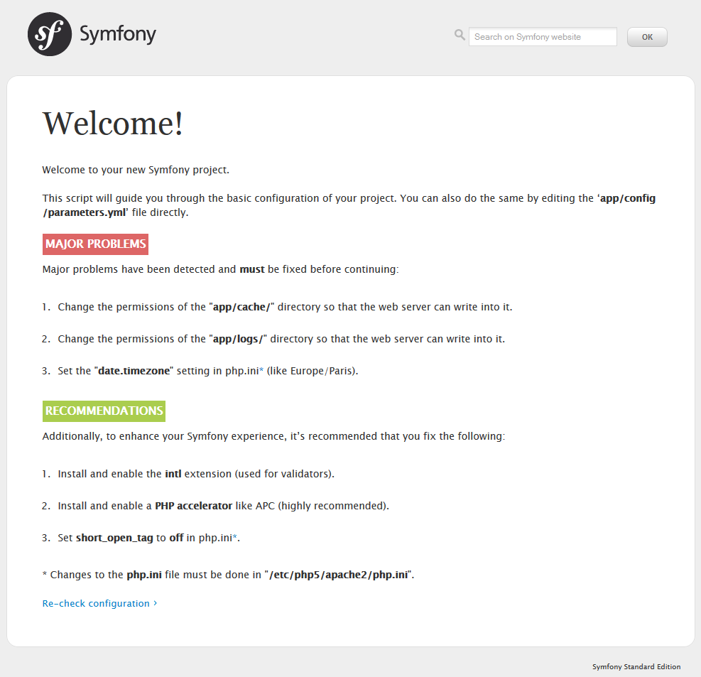

# 第一天：开始你的Jobeet项目 #

*这一系列文章来源于Fabien Potencier，基于Symfony1.4编写的[Jobeet Tutirual](http://symfony.com/legacy/doc/jobeet?orm=Doctrine)。

## 什么是Jobeet？ ##

Jobeet是一个发布求职和招聘信息的网站，它是开源的。在这一些列的教程中会教你怎么实现它。通过这Jobeet实例教程，你将会学到怎么使用最新的Web技术—Symfony2.3.2（你还不知道Symfony是什么？Symfony是一个PHP框架）。

对于每一天（每一章），从第一天开始一直到项目完成，你会学会如何去写代码实现一个真实的网站。

在这个教程期间，我们每天（每一章）都会给Jobeet添加新的功能，同时我们也会在开发过程中向你介绍Symfony的新功能和在Web开发中的良好实践。

今天是我们的第一天，你不用写任何的代码。相反，你先要搭建好开发环境。

## 搭建开发环境 ##

首先，你需要去检查一下你的系统上是否能够友好地支持Web开发的环境。我们将会使在*VMware*虚拟机上使用*Ubuntu 12.04 LTS Server*进行开发。然后你的系统上需要有Web服务器（例如Apache）、数据库（Mysql）和PHP（版本不低于5.3.3），这些要求都是最基本的。

### 1、安装Apache作为你的服务器 ###

    sudo apt-get install apache2

启动Apache的重写模块mod-rewrite：

    sudo a2enmod rewrite

### 2、安装Mysql ###

    sudo apt-get install mysql-server mysql-client

### 3、安装PHP ###

    sudo apt-get install php5 libapache2-mod-php5 php5-mysql

### 4、安装Intl扩展 ###

    sudo apt-get install php5-intl

### 5、重启Apache ###

    sudo service apache2 restart

## 下载和安装Symfony2.3.2 ##

你现在需要做的事情是需要在服务器下准备一个目录来存放Jobeet项目。那我们就把那个目录命名为*jobeet：/var/www/jobeet*。

    mkdir /var/www/jobeet

现在目录已经准备好了，那么我们要在里面放些什么呢？点击<http://symfony.com/download>，选择 *Symfony Standard 2.3.2 without vendors（2.3.2标准版）*并进行下载。现在，把下载到的文件解压到刚才准备好的*jobeet目录*中。

## 更新Vendors ##

在这一步中，你将会更新Symfony，你会使用它来开始开发你的应用。一个Symfony项目通常需要依赖很多的扩展库，这些扩展库可以通过一个叫*Composer*的库来下载，并把下载的扩展库存放在`vendor/`目录下。

在Symfony2.3.2标准版中，你可以通过*Composer*来管理依赖库。先把Composer安装到*jobeet目录*：

    curl -s https://getcomposer.org/installer | php

> 如果你还没有安装*curl*扩展，那么你可以使用如下的命令进行安装：

>     sudo apt-get install curl

接下来，输入下面的命令开始下载所有必须的第三方库：

    php composer.phar install

## 网站服务器配置 ##

一个良好的Web实践是，我们只把浏览器需要访问到的文件放在网站的根目录下，比如*css文件*，*js文件*，*图片*。在Symfony项目中，通常推荐把这些文件放在项目中的*web/*子目录中。现在来配置你的项目，你需要创建一个*虚拟主机（virtual host）*，打开你终端，输入下面的命令：

    sudo nano /etc/apache2/sites-available/jobeet.local

好了，我们创建了一个*jobeet.local*的文件。接下来，把下面的代码复制到*jobeet.local*中，然后按下*Control-O*，回车进行保存，然后*Control-X*退出编辑器。

    <VirtualHost *:80>
        ServerName jobeet.local
        DocumentRoot /var/www/jobeet/web
        DirectoryIndex app.php
        ErrorLog /var/log/apache2/jobeet-error.log
        CustomLog /var/log/apache2/jobeet-access.log combined
        <Directory "/var/www/jobeet/web">
            AllowOverride All
            Allow from All
         </Directory>
    </VirtualHost>

我们在Apache服务器中使用的*jobeet.local*本地域名需要被声明才能使用。如果你使用的*Linux*系统，那么你需要找到*/etc/hosts*文件。如果你使用的是*Windows*系统，你需要找到*c:\Windows\System32\drivers\etc\hosts*文件。把下面这行加入到*hosts*文件的末尾：

    127.0.0.1 jobeet.local

> 如果你是在非本地服务器上进行这些操作，你可以把*127.0.0.1*替换成远程服务器的ip地址。

为了使以上的配置操作能够生效，你需要启动新配置的虚拟机，重启Apache服务器。打开你的终端，输入一下命令：

    sudo a2ensite jobeet.local
    sudo service apache2 restart

Symfony有一个自带测试工具来帮助你检查你的开发环境配置是否适合使用Symfony。你可以通过下面的URL来检查你的配置：

<http://jobeet.local/config.php>



如果你不是在本地主机上运行*confoig.php*而是在远程的服务器上运行的话，那么你应该修改*web/config.php*文件，把下面这些限制外部访问的代码给注释掉：

```PHP
if (!isset($_SERVER['HTTP_HOST'])) {
    exit('This script cannot be run from the CLI. Run it from a browser.');
}

/*
if (!in_array(@$_SERVER['REMOTE_ADDR'], array(
    '127.0.0.1',
    '::1',
))) {
    header('HTTP/1.0 403 Forbidden');
    exit('This script is only accessible from localhost.');
}
*/

// ...
```

在*web/app_dev.php*中做和上面相同的修改：

```PHP
use Symfony\Component\HttpFoundation\Request;
use Symfony\Component\Debug\Debug;

// If you don't want to setup permissions the proper way, just uncomment the following PHP line
// read http://symfony.com/doc/current/book/installation.html#configuration-and-setup for more information
//umask(0000);

// This check prevents access to debug front controllers that are deployed by accident to production servers.
// Feel free to remove this, extend it, or make something more sophisticated.
/*
if (isset($_SERVER['HTTP_CLIENT_IP'])
    || isset($_SERVER['HTTP_X_FORWARDED_FOR'])
    || !in_array(@$_SERVER['REMOTE_ADDR'], array('127.0.0.1', 'fe80::1', '::1'))
) {
    header('HTTP/1.0 403 Forbidden');
    exit('You are not allowed to access this file. Check '.basename(__FILE__).' for more information.');
}
*/

$loader = require_once __DIR__.'/../app/bootstrap.php.cache';
Debug::enable();

require_once __DIR__.'/../app/AppKernel.php';

// ...
```

当你运行*config.php*后，Symfony可能会需要你满足要求。完成下面这些配置能够帮助你消除*”warnings“*。

### 1、为app/cache和app/logs修改权限 ###

    sudo chmod -R 777 app/cache
    sudo chmod -R 777 app/logs
    sudo setfacl -dR -m u::rwX app/cache app/logs

> 如果你还没有*ACL*，请先安装：

>     sudo apt-get install acl

### 2、设置php.ini中的date.timezone配置 ###

    date.timezone = Europe/Bucharest # date.timezone = Asia/Shanghai

    sudo nano /etc/php5/apache2/php.ini

在*php.ini*文件中的*[data]*部分找到*date.timezone*配置项，然后删除前面的*;*。

### 3、设置php.ini中的short\_open\_tag为false ###

    short_open_tag
        Default Value: Off

### 4、安装PHP加速器（推荐使用APC） ###

    sudo apt-get install php-apc
    sudo service apache2 restart

重启Apache，在浏览器中输入<http://jobeet.local/app_dev.php>，你将会看到下面这个页面：


## Symfony2控制台 ##

Symfony2自带了一个命令行工具，你可以使用它来完成不同任务。

你可以输入下面的命令，查看Symfony控制台能为你做些什么：

    php app/console list

## 创建应用程序的bundle ##

### bundle（包）是什么 ###

bundle十分类似于其他应用程序中的插件（plugin），但bundle比它们更好。在Symfony2.3.2中，所有的一切都是*Bundle*，包括核心的框架功能，还有你的应用中的代码。

一个bundle就是实现一个功能的接口，它由许多文件组成，这些文件有组织地被放在一起，这就组成了一个Bundle（包）。

> Tips：一个Bundle能够在任何地方使用，只要它能够被自动加载（*app/autoload.php*）。
> 在里可以了解更多关于*bundle系统*：<http://symfony.com/doc/current/book/page_creation.html#the-bundle-system>

### 创建基本的bundle框架 ###

执行下面的命令启动Symfony的bundle生成器：

    php app/console generate:bundle --namespace=Ibw/JobeetBundle

执行以上的命令后，在生成bundle之前，生成器会问你几个问题。下面是这些问题和答案（除了有一个不是默认的，其他全部都是默认的）

    Bundle name [IbwJobeetBundle]: IbwJobeetBundle
    Target directory [/var/www/jobeet/src]: /var/www/jobeet/src
    Configuration format (yml, xml, php, or annotation) [yml]: yml
    Do you want to generate the whole directory structure [no]? yes
    Do you confirm generation [yes]? yes
    Confirm automatic update of your Kernel [yes]? yes
    Confirm automatic update of the Routing [yes]? yes

生成bundle之后，清除cache：

    php app/console cache:clear --env=prod
    php app/console cache:clear --env=dev

新生成的bundle可以在*src/*目录下找到：*src/Ibw/JobeetBundle*。bundle生成器会生成一个*DefaultController*，在这个控制器中有一个*indexAction()*方法。你可以通过下面的URL访问：<http://jobeet.local/hello/jobeet>或者<http://jobeet.local/app_dev.php/hello/jobeet>

## 删除AcmeDemoBundle ##

Symfony2.3.2标准版中自带了一个完整的demo，它叫做*AcmeDemoBundle*。它是一个很好的参照样例，但你最终还是需要删除它的。

### 1、输入下面的命令删除Acme目录 ###

    rm -rf /var/www/jobeet/src/Acme

### 2、修改/var/www/jobeet/app/AppKernel.php中 ###

```PHP
// ...

$bundles[] = new Acme\DemoBundle\AcmeDemoBundle();

// ...
```

### 3、修改app/config/routing_dev.yml ###

```Yml
# ... 

# AcmeDemoBundle routes (to be removed)
_acme_demo:
    resource: "@AcmeDemoBundle/Resources/config/routing.yml"
```

### 4、清除cache ###

    php app/console cache:clear --env=prod
    php app/console cache:clear --env=dev

## 环境 ##

Symfony2.3.2拥有不同的环境。如果你去查看*web/*目录，你会发现有两个php文件：*app_dev.php*和*app.php*。这两个文件被叫做*“前端控制器”*，所有的请求都需要通过它们。*app.php*文件被用在*Production*环境，而*app_dev.php*则被用在*Development*环境。在*Development*环境下是十分方便的，因为它能够把所有程序中出现的的*errors*和*warnings*显示在调试栏（*Debug Toolbar*）上—开发者的最好的小伙伴。

好了，今天就先到这。在下一天（章）中，我们将会给详细你讲解Jobeet都有哪些功能。

# 许可证 #

如果您需要转载的话，请尊重原作者的知识产权，您可以通过把如下链接放到您转载文章中的头部或者尾部，谢谢。

原文链接：<http://www.intelligentbee.com/blog/2013/08/07/symfony2-jobeet-day-1-starting-up-the-project/>

您可以在以下链接查看该许可证的全文：


<http://creativecommons.org/licenses/by-nc/3.0/legalcode>