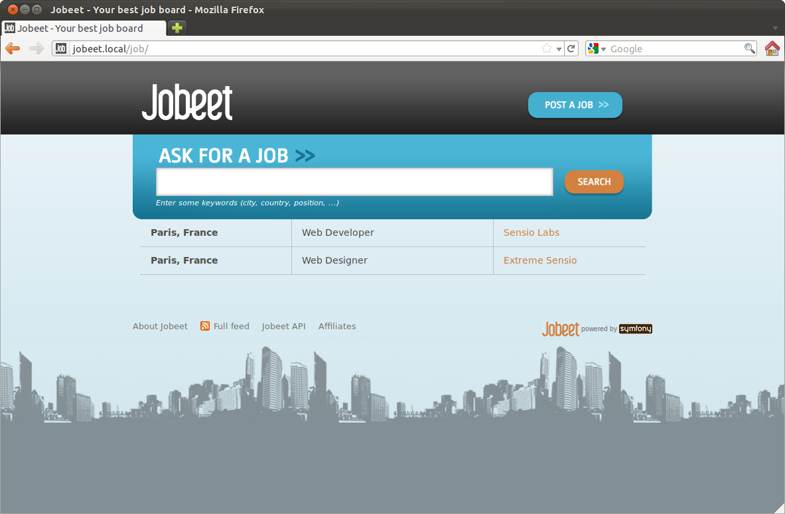
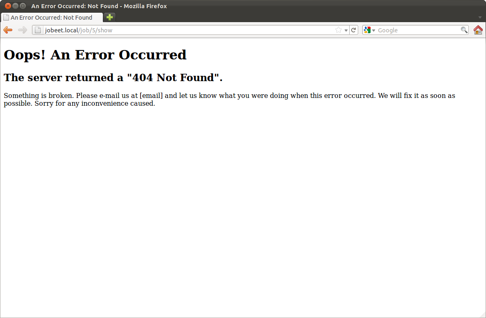
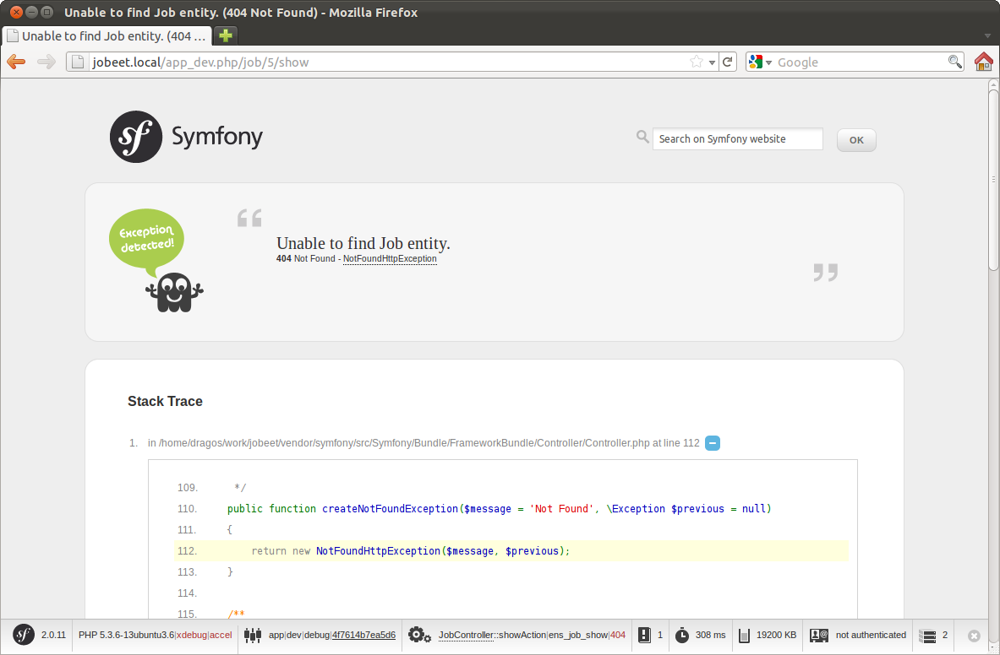

# 第四天：控制器和视图 #

*这一系列文章来源于Fabien Potencier，基于Symfony1.4编写的[Jobeet Tutirual](http://symfony.com/legacy/doc/jobeet?orm=Doctrine)。

昨天我们已经是生成了`JobController`控制器，今天就来自定义`JobController`控制器。`JobController`已经有了我们需要的大部分代码：

* 列表（list）页面
* 创建（new create）页面
* 编辑（edit update）页面
* 删除（delete）页面

我们在已用的代码之上进行重构，让这些页面更加接近[Jobeet的模型](http://symfony.com/legacy/doc/jobeet/1_4/en/02?orm=Doctrine#chapter_02_the_project_user_stories)。

## MVC架构 ##

对于Web开发来说，现在最常见的代码组织方式就是使用`MVC`设计模式。简而言之，`MVC`模式定义了一种方式去组织你的代码，这样会使你的代码更加地自然（nature）。`MVC`模式把代码分为三个层次：

* Model层：定义业务逻辑（数据库操作也属于这层）。我们已经知道了在`Symfony`中，所有和Model层相关的的类都放在你的包（`bundle`）的`Entity/`目录下。
* View层：与用户交互的界面显示（模板引擎属于这个层）。`Symfony 2.3.2`的View层使用的模板引擎主要是`Twig`。这些视图文件被放在各个`Resources/views/`目录下，我们待会就介绍它。
* Controller层：它通过Model层来获取数据，然后处理后把结果渲染到View层返回给客户端。在我们教程的一开始就安装了`Symfony`，我们已经看到所有的请求都被`前端控制器（front controller）`给管理起来了（`app.php`和`app_dev.php`）。`前端控制器`把真正的工作交给`action`处理。

## 布局 ##

如果你有仔细观察[Jobeet的模型](http://symfony.com/legacy/doc/jobeet/1_4/en/02?orm=Doctrine#chapter_02_the_project_user_stories)，你可能会注意到它们的每个页面看起来都很相似。我们都知道，不管是`PHP`代码还是`HTML`代码，重复的代码给人的感觉就是十分差，因此我们需要找到一个方法来阻止可以共用的视图重复地出现。

一种解决的方法是，我们可以先定义出页面的`header`和`footer`，然后把它们包含在每个页面中。另一种更好的办法是使用一种设计模式来解决问题：[装饰者模式](http://en.wikipedia.org/wiki/Decorator_pattern)。`装饰者模式`解决问题的方式是：模板先被渲染后再放一个全局的模板中，那个全局的模板叫做`布局（layout）`。

`Symfony2`中没有默认的布局，我们需要来创建一个布局来装饰其它的子页面模板。

我们在`src/Ibw/JobeetBundle/Resources/views/`目录下创建一个新文件`layout.html.twig`，它的代码如下：

```HTML
<!-- src/Ibw/JobeetBundle/Resources/views/layout.html.twig -->
<!DOCTYPE html>
<html>
    <head>
        <title>
            
                Jobeet - Your best job board
            
        </title>
        <meta http-equiv="Content-Type" content="text/html; charset=utf-8" />
        
            <link rel="stylesheet" href="{{ asset('bundles/ibwjobeet/css/main.css') }}" type="text/css" media="all" />
        
        
        
        <link rel="shortcut icon" href="{{ asset('bundles/ibwjobeet/images/favicon.ico') }}" />
    </head>
    <body>
        <div id="container">
            <div id="header">
                <div class="content">
                    <h1><a href="{{ path('ibw_job') }}">
                        
                    </a></h1>
 
                    <div id="sub_header">
                        <div class="post">
                            <h2>Ask for people</h2>
                            <div>
                                <a href="{{ path('ibw_job') }}">Post a Job</a>
                            </div>
                        </div>
 
                        <div class="search">
                            <h2>Ask for a job</h2>
                            <form action="" method="get">
                                <input type="text" name="keywords" id="search_keywords" />
                                <input type="submit" value="search" />
                                <div class="help">
                                    Enter some keywords (city, country, position, ...)
                                </div>
                            </form>
                        </div>
                    </div>
                </div>
            </div>
 
           <div id="content">
               
                   <div class="flash_notice">
                       {{ flashMessage }}
                   </div>
               
 
               
                   <div class="flash_error">
                       {{ flashMessage }}
                   </div>
               
 
               <div class="content">
                   
                   
               </div>
           </div>
 
           <div id="footer">
               <div class="content">
                   <span class="symfony">
                       
                           powered by <a href="http://www.symfony.com/">
                           
                       </a>
                   </span>
                   <ul>
                       <li><a href="">About Jobeet</a></li>
                       <li class="feed"><a href="">Full feed</a></li>
                       <li><a href="">Jobeet API</a></li>
                       <li class="last"><a href="">Affiliates</a></li>
                   </ul>
               </div>
           </div>
       </div>
   </body>
</html>
```

## Twig区块（Blocks） ##

`Twig`是`Symfony`默认的模板引擎，你可以向我们在上面的代码中一样定义区块（blocks）。在`Twig`的`block`中，我们可以给它们定义默认的内容（比如上面的`title block`）。待会我们将会看到如何在子模板中替换`block`中默认的内容或者是继承`block`中的内容。

现在我们要使用`layout`的话，还需要去编辑子模板（`src/Ibw/JobeetBundle/Resources/views/Job/`目录下的`index`，`edit`、`new`和`show`）去继承`layout`和重写（overwrite）`layout`中的`block content`。子模板的结构就像下面那样：

```HTML

 

    <!-- original body block code goes here -->

```

## Stylesheets，Javascripts和图片 ##

我们的教程不是教你Web设计，这里已经准备好了所有需要使用到的资源。[点击这里下载图片](http://www.intelligentbee.com/blog/downloads/jobeet-images.zip)，然后把这些`图片`放在`src/Ibw/JobeetBundle/Resources/public/images/`目录下，[点击这里下载css文件](http://www.intelligentbee.com/blog/downloads/jobeet-css.zip)，然后把`css文件`放在`src/Ibw/JobeetBundle/Resources/public/css/`目录下。

现在运行下面的命令：

    php app/console assets:install web --symlink

上面的命令是告诉`Symfony`把`css`和`图片`资源作为公用的。

在`css`文件夹中，我们可以看到有四个文件：`admin.css`，`job.css`，`jobs.css`和`main.css`。`main.css`需要被所有的`Jobeet`页面使用，所以我们把它放在布局（`layout`）中的`stylesheet twig block`里。剩下的其它三个`css`文件我们在需要用到的页面才加入。

为了能够在模板中加入新的`css`文件，我们需要重写`stylesheet block`，但需要先调用父`block`，这样才不会把`main.css`给覆盖掉（看代码就清晰了）。

```HTML
<!-- src/Ibw/JobeetBundle/Resources/views/Job/index.html.twig -->

 

    {{ parent() }}
    <link rel="stylesheet" href="{{ asset('bundles/ibwjobeet/css/jobs.css') }}" type="text/css" media="all" />

 
<!-- rest of the code -->
```

```HTML
<!-- src/Ibw/JobeetBundle/Resources/views/Job/show.html.twig -->

 

    {{ parent() }}
    <link rel="stylesheet" href="{{ asset('bundles/ibwjobeet/css/job.css') }}" type="text/css" media="all" />

 
<!-- rest of the code -->
```

## Job首页Action ##

一个`action`就是一个类中的方法。对于职位（job）首页来说，控制器是`JobController`，对应的方法是`indexAction()`。它会取出数据库中所有的职位信息。

```PHP
// src/Ibw/JobeetBundle/Controller/JobController.php
// ...
 
public function indexAction()
{
    $em = $this->getDoctrine()->getManager();
 
    $entities = $em->getRepository('IbwJobeetBundle:Job')->findAll();
 
    return $this->render('IbwJobeetBundle:Job:index.html.twig', array(
        'entities' => $entities
    ));
}
 
// ...
```

我们来仔细看看上面的代码：在`indexAction()`方法中得到了一个`Doctrine`实体管理对象（`entity manager object`），这个对象负责把数据持久化到数据库和把数据从数据库中取出。`repository`则生成一个查询去检索数据库中的`Jobs`数据，它会返回一个`Job`类型的`Doctrine ArrayColletion`对象，然后把这个对象传递给模板（视图）。

## Job首页模板 ##

`index.html.twig`模板有一个显示所有`job`的`HTML`表格。下面是它的代码：

```HTML
<!-- src/Ibw/JobeetBundle/Resources/views/Job/index.html.twig -->

 

    {{ parent() }}
    <link rel="stylesheet" href="{{ asset('bundles/ibwjobeet/css/jobs.css') }}" type="text/css" media="all" />

 

    <h1>Job list</h1>
 
    <table class="records_list">
        <thead>
            <tr>
                <th>Id</th>
                <th>Type</th>
                <th>Company</th>
                <th>Logo</th>
                <th>Url</th>
                <th>Position</th>
                <th>Location</th>
                <th>Description</th>
                <th>How_to_apply</th>
                <th>Token</th>
                <th>Is_public</th>
                <th>Is_activated</th>
                <th>Email</th>
                <th>Expires_at</th>
                <th>Created_at</th>
                <th>Updated_at</th>
                <th>Actions</th>
            </tr>
        </thead>
        <tbody>
        
            <tr>
                <td><a href="{{ path('ibw_job_show', { 'id': entity.id }) }}">{{ entity.id }}</a></td>
                <td>{{ entity.type }}</td>
                <td>{{ entity.company }}</td>
                <td>{{ entity.logo }}</td>
                <td>{{ entity.url }}</td>
                <td>{{ entity.position }}</td>
                <td>{{ entity.location }}</td>
                <td>{{ entity.description }}</td>
                <td>{{ entity.howtoapply }}</td>
                <td>{{ entity.token }}</td>
                <td>{{ entity.ispublic }}</td>
                <td>{{ entity.isactivated }}</td>
                <td>{{ entity.email }}</td>
                <td>{{ entity.expiresat|date('Y-m-d H:i:s') }}</td>
                <td>{{ entity.createdat|date('Y-m-d H:i:s') }}</td>
                <td>{{ entity.updatedat|date('Y-m-d H:i:s') }}</td>
                <td>
                    <ul>
                        <li>
                            <a href="{{ path('ibw_job_show', { 'id': entity.id }) }}">show</a>
                        </li>
                        <li>
                            <a href="{{ path('ibw_job_edit', { 'id': entity.id }) }}">edit </a>
                        </li>
                    </ul>
                </td>
            </tr>
        
        </tbody>
    </table>
 
    <ul>
        <li>
            <a href="{{ path('ibw_job_new') }}">
                Create a new entry
            </a>
        </li>
    </ul>

```

我们来清除一些不需要显示出来的列（columns）。用下面的代码替换`twig block content`：

```HTML
<!-- src/Ibw/JobeetBundle/Resources/views/Job/index.html.twig -->

    <div id="jobs">
        <table class="jobs">
            
                <tr class="{{ cycle(['even', 'odd'], loop.index) }}">
                    <td class="location">{{ entity.location }}</td>
                    <td class="position">
                        <a href="{{ path('ibw_job_show', { 'id': entity.id }) }}">
                            {{ entity.position }}
                        </a>
                    </td>
                    <td class="company">{{ entity.company }}</td>
                </tr>
            
        </table>
    </div>

```


## Job页面模板 ##

现在我们来自定义`job`页面模板。打开`show.html.twig`，用下面的代码替换它：

```HTML
<!-- src/Ibw/JobeetBundle/Resources/views/Job/show.html.twig -->

 

    {{ entity.company }} is looking for a {{ entity.position }}

 

    {{ parent() }}
    <link rel="stylesheet" href="{{ asset('bundles/ibwjobeet/css/job.css') }}" type="text/css" media="all" />

 

    <div id="job">
        <h1>{{ entity.company }}</h1>
        <h2>{{ entity.location }}</h2>
        <h3>
            {{ entity.position }}
            <small> - {{ entity.type }}</small>
        </h3>
 
        
            <div class="logo">
                <a href="{{ entity.url }}">
                    
                </a>
            </div>
        
 
        <div class="description">
            {{ entity.description|nl2br }}
        </div>
 
        <h4>How to apply?</h4>
 
        <p class="how_to_apply">{{ entity.howtoapply }}</p>
 
        <div class="meta">
            <small>posted on {{ entity.createdat|date('m/d/Y') }}</small>
        </div>
 
        <div style="padding: 20px 0">
            <a href="{{ path('ibw_job_edit', { 'id': entity.id }) }}">
                Edit
            </a>
        </div>
    </div>

```



## Job页面的Action ##

`job`的页面是通过`show`这个动作生成的，`showAction()`被定义在`JobController`：

```PHP
// src/Ibw/JobeetBundle/Controller/JobController.php
public function showAction($id)
{
    $em = $this->getDoctrine()->getManager();
 
    $entity = $em->getRepository('IbwJobeetBundle:Job')->find($id);
 
    if (!$entity) {
        throw $this->createNotFoundException('Unable to find Job entity.');
    }
 
    $deleteForm = $this->createDeleteForm($id);
 
    return $this->render('IbwJobeetBundle:Job:show.html.twig', array(
        'entity' => $entity,
        'delete_form' => $deleteForm->createView(),
    ));
}
```

就像`indexAction()`中一样，`IbwJobeetBundle repository`是用来检索一个指定的`job`，但这次使用的是`find()`方法。`find()`方法的参数是`job`的唯一标识符，即`主键`。下部分会告诉你`showAction()`为什么知道这个`job`的主键`$id`的值。

如果需要查看的`job`不存在，`throw $this->createNotFoundException()`将会把我们转到`404页面`。

异常（excpetions）在`production`环境和`devlopment`环境下显示的页面会不同。





今天我们就先到这，明天我们来熟悉一下路由（`routing`）功能。

# 许可证 #

如果您需要转载的话，请尊重原作者的知识产权，您可以通过把如下链接放到您转载文章中的头部或者尾部，谢谢。

原文链接：<http://www.intelligentbee.com/blog/2013/08/07/symfony2-jobeet-day-1-starting-up-the-project/>

您可以在以下链接查看该许可证的全文：


<http://creativecommons.org/licenses/by-nc/3.0/legalcode>