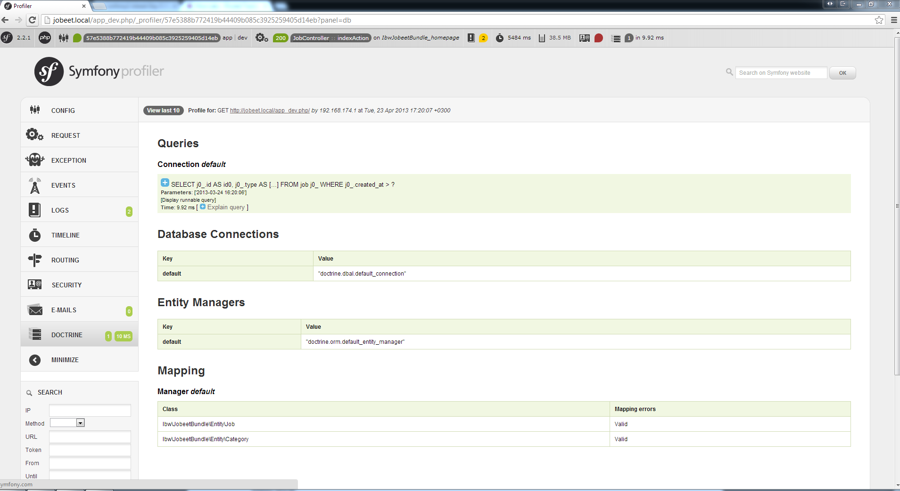
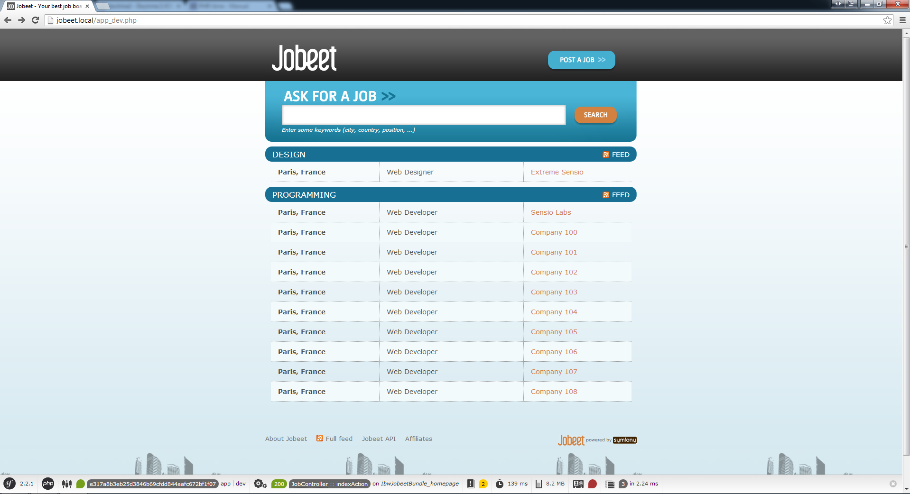
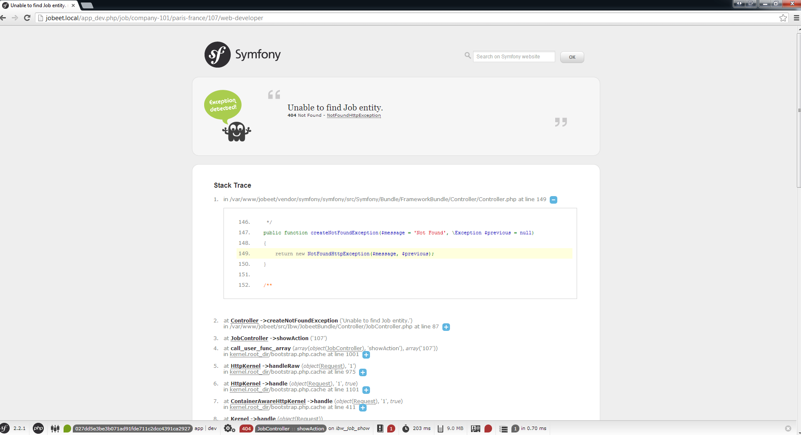

# 第六天：更多的数据模型 #

*这一系列文章来源于Fabien Potencier，基于Symfony1.4编写的[Jobeet Tutirual](http://symfony.com/legacy/doc/jobeet?orm=Doctrine)。

## Doctrine查询对象 ##

在第二天的内容中我们定义了这样一个需求（requirements）：“在Job首页显示最近发布的和在有效期内的Job信息列表”。我们现在在首页中显示的是数据库中全部的Job数据，而没有考虑到不需要在首页中显示已过期的Job信息。

```PHP
// src/Ibw/JobeetBundle/Controller/JobController.php
// ...
 
class JobController extends Controller
{
    public function indexAction()
    {
        $em = $this->getDoctrine()->getManager();
 
        $entities = $em->getRepository('IbwJobeetBundle:Job')->findAll();
 
        return $this->render('IbwJobeetBundle:Job:index.html.twig', array(
            'entities' => $entities
        ));
 
 // ...
}
```

一个在有效期限内的Job数据就代表着这个Job信息发布的日期在30天之内。`$entities = $em->getRepository('IbwJobeetBundle')->findAll()`这行代码是从数据库中取出所有的Job数据，因为我们并没有给查询指定任何的条件。

现在我们来做些修改，我们希望取出的是在有效期内的Job数据：

```PHP
// src/Ibw/JobeetBundle/Controller/JobController.php
public function indexAction()
{
    $em = $this->getDoctrine()->getManager();
 
    $query = $em->createQuery(
        'SELECT j FROM IbwJobeetBundle:Job j WHERE j.created_at > :date'
    )->setParameter('date', date('Y-m-d H:i:s', time() - 86400 * 30));
    $entities = $query->getResult();
 
    return $this->render('IbwJobeetBundle:Job:index.html.twig', array(
        'entities' => $entities
    ));
}
```

## 调试Doctrine生成的SQL ##

有时候查看Doctrine生成出来的SQL对我们调试Bug是很有帮助的。比如，我们可能在使用Doctrine进行数据库查询时得不到我们所期望的结果时，那么我们就很需要去查看Doctrine生成的SQL，并以此来对我们的代码进行排错。在开发环境（development）下，还好有Symfony的调试工具栏（浏览器页面的最下面的那条栏），我们能在调试栏中找到大量我们在调试过程中需要用到的信息，包括刚才所说的SQL调试（<http://jobeet.local/app_dev.php>）。



## 序列化对象 ##

尽管上面的代码可以运行了，但这离完美还差很远呢，因为我们还没有考虑到另一个需求：“一个用户能够重新激活或者延续Job信息的期限多30天”。

在上面的代码中我们只依赖了*created_at*的值来取出不过期的Job数据，由于*created_at*代表的是Job的创建时间，如果我们还需要表示Job数据的过期时间，我们还要另外一些列（columns）。

如果你还记得我们在[第三天](https://github.com/happen-zhang/symfony2-jobeet-tutorial/blob/master/chapter-03/chapter-03.md)的内容中描述的数据表结构的话，你肯定会记起我们还定义了一个*expires_at*列。由于我们还没在fixture文件中设置*expires_at*的值，所以它们的值都是空的。我们需要的是，当一个Job被创建的时候，*expires_at*的值就会被设置成*created_at*值的30天之后。

每当我们需要在Doctrine对象被序列化到数据库中之前能够自动执行一些操作的时候，我们可以添加一个新的行为（action）到ORM映射文件的*lifecycle callback*区块中，就像我们之前对*created_at*列进行的操作：

```YAML
# src/Ibw/JobeetBundle/Resources/config/doctrine/Job.orm.yml
# ...
    # ...
    lifecycleCallbacks:
        prePersist: [ setCreatedAtValue, setExpiresAtValue ]
        preUpdate: [ setUpdatedAtValue ]
```

现在我们需要重新生成实体类（entity class），这样Doctrine就会在Job实体类中添加一个*setExpiresAtValue()*函数：

    php app/console doctrine:generate:entities IbwJobeetBundle

打开*src/Ibw/JobeetBundle/Entity/Job.php*文件，我们来编辑*setExpiresAtValue()*函数：

```PHP
// src/Ibw/JobeetBundle/Entity/Job.php
// ...
 
class Job
{
    // ... 
 
    public function setExpiresAtValue()
    {
        if(!$this->getExpiresAt()) {
            $now = $this->getCreatedAt() ? $this->getCreatedAt()->format('U') : time();
            $this->expires_at = new \DateTime(date('Y-m-d H:i:s', $now + 86400 * 30));
        }
    }
}
```

好，现在让我们来用*expires_at*列来替换*created_at*列来取出未过期的Job数据：

```PHP
// src/Ibw/JobeetBundle/Controller/JobController.php
// ...
 
    public function indexAction()
    {
        $em = $this->getDoctrine()->getManager();
 
        $query = $em->createQuery(
            'SELECT j FROM IbwJobeetBundle:Job j WHERE j.expires_at > :date'
    )->setParameter('date', date('Y-m-d H:i:s', time()));
        $entities = $query->getResult();
 
        return $this->render('IbwJobeetBundle:Job:index.html.twig', array(
            'entities' => $entities
        ));
    }
 
// ...
```

## 加入更多的Fixtures ##

现在我们刷新浏览器中的Job首页，我们不会看到页面有任何的改变，因为我们之前加入到数据库中的Job数据都才仅仅发布了几天，所以现在数据库中的Job数据都是在有效期内的。让我们在fixture文件中加入一些已过期的（*expired*）的Job数据吧：

```PHP
// src/Ibw/JobeetBundle/DataFixtures/ORM/LoadJobData.php
// ...
 
    public function load(ObjectManager $em)
    {
        $job_expired = new Job();
        $job_expired->setCategory($em->merge($this->getReference('category-programming')));
        $job_expired->setType('full-time');
        $job_expired->setCompany('Sensio Labs');
        $job_expired->setLogo('sensio-labs.gif');
        $job_expired->setUrl('http://www.sensiolabs.com/');
        $job_expired->setPosition('Web Developer Expired');
        $job_expired->setLocation('Paris, France');
        $job_expired->setDescription('Lorem ipsum dolor sit amet, consectetur adipisicing elit.');
        $job_expired->setHowToApply('Send your resume to lorem.ipsum [at] dolor.sit');
        $job_expired->setIsPublic(true);
        $job_expired->setIsActivated(true);
        $job_expired->setToken('job_expired');
        $job_expired->setEmail('job@example.com');
        $job_expired->setCreatedAt(new \DateTime('2005-12-01'));
 
        // ...
 
        $em->persist($job_expired);
        // ...
    }
 
// ...
```

现在我们来重新加载fixtures，然后刷新浏览器，确保过期的Job信息不会被显示出来：

    php app/console doctrine:fixtures:load

## 重构代码 ##

尽管上面的代码已经能运行了，但我们所做得还是不够好，你能发现其中有什么问题吗？

Doctrine的查询代码不应该属于action（Controller层），它应该属于Model层。在MVC模式中，Model层定义的是业务逻辑，而Controller层则通过是Model层来从数据库中取出数据。现在我们来把之前从数据库中获取Job数据集合的代码从Controller层移到Model层吧。现在我们为Job实体类创建一个Repository类。

打开*/src/Ibw/JobeetBundle/Resources/config/doctrine/Job.orm.yml*，添加下面的代码：

```YAML
Ibw\JobeetBundle\Entity\Job:
    type: entity
    repositoryClass: Ibw\JobeetBundle\Repository\JobRepository
    # ...
```

运行下面的命令，Doctrine能够帮我们生成Repository类：

    php app/console doctrine:generate:entities IbwJobeetBundle

下一步我们来给JobRepository类添加一个方法：*getActiveJobs()*。这个方法可以取出有效期内的Job数据，并且按照*expires_at*的值进行排序（它还可以接受一个*$category_id*参数，它可以按分类来取出Job数据）。

```PHP
// src/Ibw/JobeetBundle/Repository/JobRepository.php
namespace Ibw\JobeetBundle\Repository;

use Doctrine\ORM\EntityRepository;

/**
 * JobRepository
 *
 * This class was generated by the Doctrine ORM. Add your own custom
 * repository methods below.
 */
class JobRepository extends EntityRepository
{
    public function getActiveJobs($category_id = null)
    {
        $qb = $this->createQueryBuilder('j')
                   ->where('j.expires_at > :date')
                   ->setParameter('date', date('Y-m-d H:i:s', time()))
                   ->orderBy('j.expires_at', 'DESC');

        if ($category_id) {
            $qb->andWhere('j.category = :category_id')
               ->setParameter('category_id', $category_id);
        }

        $query = $qb->getQuery();

        return $query->getResult();
    }
}
```

现在action里面就可以使用刚才添加的*getActiveJobs()*方法了。

```PHP
// src/Ibw/JobeetBundle/Controller/JobController.php
// ...
 
    public function indexAction()
    {
        $em = $this->getDoctrine()->getManager();
 
        $entities = $em->getRepository('IbwJobeetBundle:Job')->getActiveJobs();
 
        return $this->render('IbwJobeetBundle:Job:index.html.twig', array(
            'entities' => $entities
        ));
    }
 
// ...
```

上面重构后的代码比起之前的未重构代码有如下优点：

* 获取有效期内的Job数据的代码现在位于Model层中
* *JobController::indexAction()*中的代码更少了，可读性也提高了
* *getActiveJobs()*方法可以被重用
* 更加容易地对model的代码进行测试

## 首页中的Categories ##

根据我们第二天内容中的需求，Job信息能够按照分类进行显示。直到现在我们都还没考虑到对Job信息进行分类显示。按照第二天内容中的需求，我们需要在首页中按照不同的分类来显示Job信息。首先，我们需要获得包含有未过期的Job数据的所有分类。

为Category实体创建一个Repository类：

```YAML
# src/Ibw/JobeetBundle/Resources/config/doctrine/Category.orm.yml
Ibw\JobeetBundle\Entity\Category:
    type: entity
    repositoryClass: Ibw\JobeetBundle\Repository\CategoryRepository
    #...
```

生成Repository类：

    php app/console doctrine:generate:entities IbwJobeetBundle

打开*src/Ibw/JobeetBundle/Repository/CategoryRepository.php*文件，添加*getWithJobs()*方法：

```PHP
// src/Ibw/JobeetBundle/Repository/CategoryRepository.php
namespace Ibw\JobeetBundle\Repository;
 
use Doctrine\ORM\EntityRepository;
 
/**
 * CategoryRepository
 *
 * This class was generated by the Doctrine ORM. Add your own custom
 * repository methods below.
 */
class CategoryRepository extends EntityRepository
{
    public function getWithJobs()
    {
        $query = $this->getEntityManager()->createQuery(
            'SELECT c FROM IbwJobeetBundle:Category c LEFT JOIN c.jobs j WHERE j.expires_at > :date'
        )->setParameter('date', date('Y-m-d H:i:s', time()));
 
        return $query->getResult();
    }   
}
```

同时我们需要修改*indexAction()*方法：

```PHP
// src/Ibw/JobeetBundle/Controller/JobController.php
// ...
 
    public function indexAction()
    {
        $em = $this->getDoctrine()->getManager();
 
        $categories = $em->getRepository('IbwJobeetBundle:Category')->getWithJobs();
 
        foreach($categories as $category) {
            $category->setActiveJobs($em->getRepository('IbwJobeetBundle:Job')->getActiveJobs($category->getId()));
        }
 
        return $this->render('IbwJobeetBundle:Job:index.html.twig', array(
            'categories' => $categories
        ));
    }
 
// ...
```

我们在上面的代码中可以看到Category有个*setActiveJobs()*方法，那么现在我们来修改这个方法：

```PHP
// src/Ibw/JobeetBundle/Entity/Category.php
class Category
{
    // ...
 
    private $active_jobs;
 
    // ...
 
    public function setActiveJobs($jobs)
    {
        $this->active_jobs = $jobs;
    }
 
    public function getActiveJobs()
    {
        return $this->active_jobs;
    }
}
```

在模板中，我们需要通过迭代变量`categories`的值来显示所有的Job数据：

```HTML
<!-- src/Ibw/JobeetBundle/Resources/views/Job/index.html.twig -->
<!-- ... -->

    <div id="jobs">
        
            <div>
                <div class="category">
                    <div class="feed">
                        <a href="">Feed</a>
                    </div>
                    <h1>{{ category.name }}</h1>
                </div>
                <table class="jobs">
                    
                        <tr class="{{ cycle(['even', 'odd'], loop.index) }}">
                            <td class="location">{{ entity.location }}</td>
                            <td class="position">
                                <a href="{{ path('ibw_job_show', { 'id': entity.id, 'company': entity.companyslug, 'location': entity.locationslug, 'position': entity.positionslug }) }}">
                                    {{ entity.position }}
                                </a>
                            </td>
                             <td class="company">{{ entity.company }}</td>
                        </tr>
                    
                </table>
            </div>
        
    </div>

```

## 限制结果行数 ##

我们现在需要限制Job信息列表中显示的行数为10行。实现这个功能非常简单，我们来给*JobRepository::getActiveJobs()*方法添加一个`$max`参数：

```PHP
// src/Ibw/JobeetBundle/Repository/JobRepository.php
public function getActiveJobs($category_id = null, $max = null)
{
    $qb = $this->createQueryBuilder('j')
        ->where('j.expires_at > :date')
        ->setParameter('date', date('Y-m-d H:i:s', time()))
        ->orderBy('j.expires_at', 'DESC');

    if($max) {
        $qb->setMaxResults($max);
    }

    if($category_id) {
        $qb->andWhere('j.category = :category_id')
            ->setParameter('category_id', $category_id);
    }

    $query = $qb->getQuery();

    return $query->getResult();
}
```

修改*indexAction()*方法中的代码，我们需要使用`$max`参数来调用*getActiveJobs()*方法：

```PHP
// src/Ibw/JobeetBundle/Controller/JobController.php
// ...
 
public function indexAction()
{
    $em = $this->getDoctrine()->getManager();

    $categories = $em->getRepository('IbwJobeetBundle:Category')->getWithJobs();

    foreach($categories as $category)
    {
        $category->setActiveJobs($em->getRepository('IbwJobeetBundle:Job')->getActiveJobs($category->getId(), 10));
    }

    return $this->render('IbwJobeetBundle:Job:index.html.twig', array(
        'categories' => $categories
    ));
}
 
// ...
```

## 自定义配置 ##

在*JobController::indexAction()*方法中，我们对返回Job数据的行数（*$max = 10*）进行了**硬编码（hardcode）**，我们需要让返回行数的值是可配置的。在Symfony中，我们可以在*app/config/config.yml*文件中的*parameters*区块中自定义一些配置（如果*parameters*区块不存在的话，那么我们也可以自行创建它）。

```YAML
# app/config/config.yml
# ...
 
parameters:
    max_jobs_on_homepage: 10
```

定义好后我们就可以在Controller中访问它们的值了：

```PHP
// src/Ibw/JobeetBundle/Controller/JobController.php
// ...
 
    public function indexAction()
    {
        $em = $this->getDoctrine()->getManager();
 
        $categories = $em->getRepository('IbwJobeetBundle:Category')->getWithJobs();
 
        foreach($categories as $category) {
            $category->setActiveJobs($em->getRepository('IbwJobeetBundle:Job')->getActiveJobs($category->getId(), $this->container->getParameter('max_jobs_on_homepage')));
        }
 
        return $this->render('IbwJobeetBundle:Job:index.html.twig', array(
            'categories' => $categories
        ));
    }
 
// ...
```

## 动态Fixtures ##

对于上面所做的修改，我们还不能在页面中看到有什么变化，因为现在我们的数据库中只有很少量的Job数据。现在我们需要在fixture中批量添加Job数据。我们可选择手动复制之前已存在的代码来重复进行生成Job数据，但我们有更好的办法。我们需要引起注意的是，重复的代码给人的感觉就是很差，甚至在fixture文件中出现重复的代码：

```PHP
// src/Ibw/JobeetBundle/DataFixtures/ORM/LoadJobData.php
// ...
 
public function load(ObjectManager $em)
{
    // ...
 
    for($i = 100; $i <= 130; $i++)
    {
        $job = new Job();
        $job->setCategory($em->merge($this->getReference('category-programming')));
        $job->setType('full-time');
        $job->setCompany('Company '.$i);
        $job->setPosition('Web Developer');
        $job->setLocation('Paris, France');
        $job->setDescription('Lorem ipsum dolor sit amet, consectetur adipisicing elit.');
        $job->setHowToApply('Send your resume to lorem.ipsum [at] dolor.sit');
        $job->setIsPublic(true);
        $job->setIsActivated(true);
        $job->setToken('job_'.$i);
        $job->setEmail('job@example.com');
 
        $em->persist($job);
    }
 
    // ... 
    $em->flush();
}
 
// ...
```

现在用`doctrine:fixtures:load`命令来重新加载fixture，观察*Programming*分类下的Job信息行数是否为10行：



## 过期的Job页面 ##

如果一个Job不在有效期限内了，那么它将是不再可能被用户访问到的，即使用户知道它所在的URL也不行。我们可以尝试着访问过期的Job信息的页面（获得过期的Job信息的id的方法：`select id, token from job where expires_at < NOW()`，然后把获得的id替换下面URL中ID的值）:

    /app_dev.php/job/sensio-labs/paris-france/ID/web-developer-expired

每当用户访问过期的Job信息页面时，我们应该让用户重定向到**404页面**。现在我们来给JobRepository添加一个方法：

```PHP
// src/Ibw/JobeetBundle/Repository/JobRepository.php
// ...
 
public function getActiveJob($id)
{
    $query = $this->createQueryBuilder('j')
        ->where('j.id = :id')
        ->setParameter('id', $id)
        ->andWhere('j.expires_at > :date')
        ->setParameter('date', date('Y-m-d H:i:s', time()))
        ->setMaxResults(1)
        ->getQuery();

    try {
        $job = $query->getSingleResult();
    } catch (\Doctrine\Orm\NoResultException $e) {
        $job = null;
    }

    return $job;
}
```

> 如果没有结果被返回，那么*getSingleResult()*方法会抛出Doctrine\ORM\NoResultException异常；如果返回的结果不止一个，那么*getSingleResult()*方法会抛出Doctrine\ORM\NonUniqueResultException异常。如果你使用*getSingleResult()*方法，那么请用*try...catch*语句包含它，以至于确保所返回的结果集只有一行数据。

现在修改*JobController::showAction()*方法：

```PHP
// src/Ibw/JobeetBundle/Controller/JobController.php
// ...
 
$entity = $em->getRepository('IbwJobeetBundle:Job')->getActiveJob($id);
 
// ...
```

现在我们去访问一个已过期的Job信息页面，我们会被重定向到**404页面**：



好了，我们今天就到这吧。我们明天会开始实现Category页面。

# 许可证 #

如果您需要转载的话，请尊重原作者的知识产权，您可以通过把如下链接放到您转载文章中的头部或者尾部，谢谢。

原文链接：<http://www.intelligentbee.com/blog/2013/08/12/symfony2-jobeet-day-6-more-with-the-model/>

您可以在以下链接查看该许可证的全文：


<http://creativecommons.org/licenses/by-nc/3.0/legalcode>
