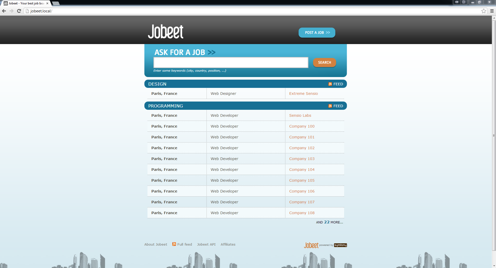
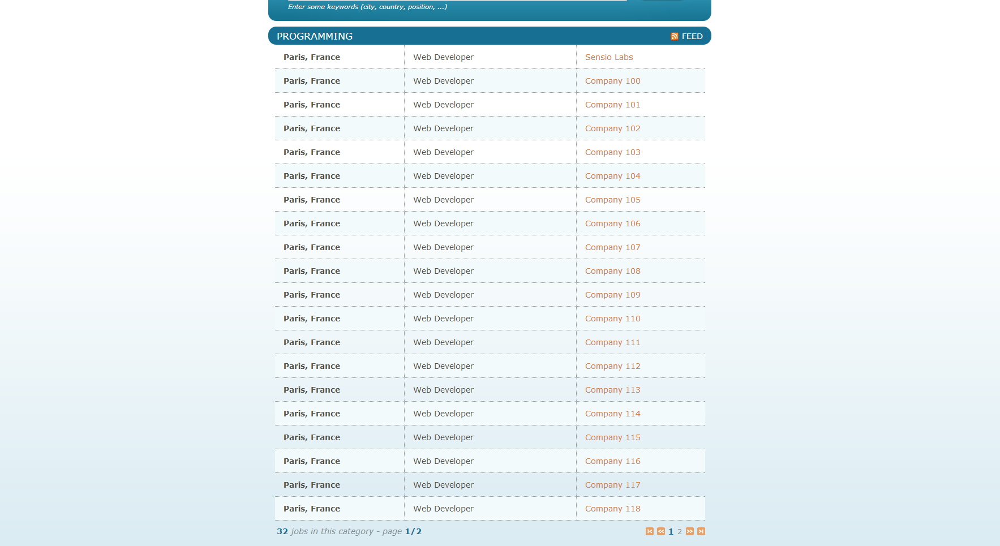

# 第七天：实现分类页面 #

*这一系列文章来源于Fabien Potencier，基于Symfony1.4编写的[Jobeet Tutirual](http://symfony.com/legacy/doc/jobeet?orm=Doctrine)。

今天我们就来完成第二天中的`category`需求，实现`category`的相关页面：

> 用户能够查看同一`category`中的所有`job`，并且`job`按照发布时间排序，每页显示20条`job`信息

## 配置Category路由 ##

首先，我们要为`category`页面提添加易理解的URL。把下面的代码添加到路由文件的开头：

```YAML
# src/Ibw/JobeetBundle/Resources/config/routing.yml
# ...
IbwJobeetBundle_category:
    pattern:  /category/{slug}
    defaults: { _controller: IbwJobeetBundle:Category:show }
```

为了得到转义过的`category`名，我们需要在`Category`类中添加`getSlug()`方法：

```PHP
// src/Ibw/JobeetBundle/Entity/Category.php
use Ibw\JobeetBundle\Utils\Jobeet as Jobeet;
 
class Category
{
    // ...
 
    public function getSlug()
    {
        return Jobeet::slugify($this->getName());
    }
}

```

## 添加链接到Category页面的URL ##

现在编辑`JobController`下的`index.html.twig`模板，让它能链接到`category`页面：

```HTML
<!-- src/Ibw/JobeetBundle/Resources/views/Job/index.html.twig -->
<!-- some HTML code -->
 
                    <h1><a href="{{ path('IbwJobeetBundle_category', { 'slug': category.slug }) }}">{{ category.name }}</a></h1>
 
<!-- some HTML code -->
 
                </table>
 
                
                    <div class="more_jobs">
                        and <a href="{{ path('IbwJobeetBundle_category', { 'slug': category.slug }) }}">{{ category.morejobs }}</a>
                        more...
                    </div>
                
            </div>
        
    </div>

```

在上面的模板中，我们使用到了`category.morejobs`，所以我们需要定义它：

```PHP
// src/Ibw/JobeetBundle/Entity/Category.php
class Category
{
    // ...
 
    private $more_jobs;
 
    // ...
 
    public function setMoreJobs($jobs)
    {
        $this->more_jobs = $jobs >=  0 ? $jobs : 0;
    }
 
    public function getMoreJobs()
    {
        return $this->more_jobs;
    }
}
```

属于同一`category`下的`job`的总行数减去首页中显示同一`category`下的`job`列表的行数的结果就是`more_jobs`属性中`job`的数量（看代码）。

```PHP
// src/Ibw/JobeetBundle/Controller/JobController.php
public function indexAction()
{
    $em = $this->getDoctrine()->getManager();
 
    $categories = $em->getRepository('IbwJobeetBundle:Category')->getWithJobs();
 
    foreach($categories as $category)
    {
        $category->setActiveJobs($em->getRepository('IbwJobeetBundle:Job')->getActiveJobs($category->getId(), $this->container->getParameter('max_jobs_on_homepage')));
        $category->setMoreJobs($em->getRepository('IbwJobeetBundle:Job')->countActiveJobs($category->getId()) - $this->container->getParameter('max_jobs_on_homepage'));
    }
 
    return $this->render('IbwJobeetBundle:Job:index.html.twig', array(
        'categories' => $categories
    ));
}
```

我们需要在`JobRepository`类中加入`countActiveJobs()`方法：

```PHP
// src/Ibw/JobeetBundle/Repository/JobRepository.php
// ...
 
public function countActiveJobs($category_id = null)
{
    $qb = $this->createQueryBuilder('j')
        ->select('count(j.id)')
        ->where('j.expires_at > :date')
        ->setParameter('date', date('Y-m-d H:i:s', time()));
 
    if($category_id)
    {
        $qb->andWhere('j.category = :category_id')
        ->setParameter('category_id', $category_id);
    }
 
    $query = $qb->getQuery();
 
    return $query->getSingleScalarResult();
}
 
// ...
```

现在你可以在浏览器中看到下面的结果：



## 创建CategoryController控制器 ##

现在是时候创建 `CategoryController`控制器了。我们在`src/Ibw/JobeetBundle/Controller`目录下添加`CategoryController.php`文件：

```PHP
// src/Ibw/JobeetBundle/Controller/CategoryController.php
namespace Ibw\JobeetBundle\Controller;
 
use Symfony\Bundle\FrameworkBundle\Controller\Controller;
use Ibw\JobeetBundle\Entity\Category;
 
/**
* Category controller
*
*/
class CategoryController extends Controller
{
 
}
```

和之前的`job`类似，我们可以使用`doctrine:generate:crud`命令生成控制器，但其中生成的90%代码是我们不需要的，因此我们选择手动创建一个新的控制器。

## 更新数据库 ##

我们现在为`category`添加一个`slug`列，同时加入`lifecycleCallbacks`来自动设置`slug`的值：

```YAML
# src/Ibw/JobeetBundle/Resources/config/doctrine/Category.orm.yml
Ibw\JobeetBundle\Entity\Category:
    type: entity
    repositoryClass: Ibw\JobeetBundle\Repository\CategoryRepository
    table: category
    id:
        id:
            type: integer
            generator: { strategy: AUTO }
    fields:
        name:
            type: string
            length: 255
            unique: true
        slug:
            type: string
            length: 255
            unique: true
    oneToMany:
        jobs:
            targetEntity: Job
            mappedBy: category
    manyToMany:
        affiliates:
            targetEntity: Affiliate
            mappedBy: categories
    lifecycleCallbacks:
        prePersist: [ setSlugValue ]
        preUpdate: [ setSlugValue ]
```

删除`Category`实体（`src/Ibw/JobeetBundle/Entity/Category.php`）中的`getSlug()`方法，然后运行下面的命令更新`Category`实体：

    php app/console doctrine:generate:entities IbwJobeetBundle

现在你会看到`Category.php`中添加了下面的代码：

```PHP
// src/Ibw/JobeetBundle/Entity/Category.php
// ...    
/**
 * @var string
 */
private $slug;

/**
 * Set slug
 *
 * @param string $slug
 * @return Category
 */
public function setSlug($slug)
{
    $this->slug = $slug;

    return $this;
}

/**
 * Get slug
 *
 * @return string 
 */
public function getSlug()
{
    return $this->slug;
}
```

修改`setSlugValue()`方法：

```PHP
// src/Ibw/JobeetBundle/Entity/Category.php
// ...
 
class Category
{
    // ...
 
    public function setSlugValue()
    {
        $this->slug = Jobeet::slugify($this->getName());
    }
}
```

因为我们为`category`加入了`slug`列，所以需要更新数据表，现在我们需要删掉之前的数据库并重新创建，然后加载`fixture`：

    php app/console doctrine:database:drop --force
    php app/console doctrine:database:create
    php app/console doctrine:schema:update --force
    php app/console doctrine:fixtures:load

## Category页面 ##

现在我们需要往`showAction()`方法中添加一些东西了。在`CategoryController.php`中添加下面的代码：

```PHP
// src/Ibw/JobeetBundle/Controller/CategoryController.php
// ...
 
public function showAction($slug)
{
    $em = $this->getDoctrine()->getManager();
 
    $category = $em->getRepository('IbwJobeetBundle:Category')->findOneBySlug($slug);
 
    if (!$category) {
        throw $this->createNotFoundException('Unable to find Category entity.');
    }
 
    $category->setActiveJobs($em->getRepository('IbwJobeetBundle:Job')->getActiveJobs($category->getId()));
 
    return $this->render('IbwJobeetBundle:Category:show.html.twig', array(
        'category' => $category,
    ));
}
 
// ...
```

接下来我们创建`show.html.twig`模板：

```HTML
<!-- src/Ibw/JobeetBundle/Resources/views/Category/show.html.twig -->

 

    Jobs in the {{ category.name }} category

 

    {{ parent() }}
    <link rel="stylesheet" href="{{ asset('bundles/ibwjobeet/css/jobs.css') }}" type="text/css" media="all" />

 

    <div class="category">
        <div class="feed">
            <a href="">Feed</a>
        </div>
        <h1>{{ category.name }}</h1>
    </div>
 
    <table class="jobs">
        
            <tr class="{{ cycle(['even', 'odd'], loop.index) }}">
                <td class="location">{{ entity.location }}</td>
                <td class="position">
                    <a href="{{ path('ibw_job_show', { 'id': entity.id, 'company': entity.companyslug, 'location': entity.locationslug, 'position': entity.positionslug }) }}">
                        {{ entity.position }}
                    </a>
                </td>
                <td class="company">{{ entity.company }}</td>
            </tr>
        
    </table>

```

## 包含一个Twig模板 ##

你可能注意到了，我们在`category`中的`show.html.twig`创建`job`列表的HTML代码和`job`中的`index.html.twig`中的代码一样，代码重复很不好。当你需要重用模板中的一些代码，你需要创建一个新的`twig`模板，然后在需要的模板中把它包含进来即可。我们创建`list.html.twig`文件：

```HTML
<!-- src/Ibw/JobeetBundle/Resources/views/Job/list.html.twig -->
<table class="jobs">
    
        <tr class="{{ cycle(['even', 'odd'], loop.index) }}">
            <td class="location">{{ entity.location }}</td>
            <td class="position">
                <a href="{{ path('ibw_job_show', { 'id': entity.id, 'company': entity.companyslug, 'location': entity.locationslug, 'position': entity.positionslug }) }}">
                    {{ entity.position }}
                </a>
            </td>
            <td class="company">{{ entity.company }}</td>
        </tr>
    
</table>
```

你可以在模板中使用`include`函数来替换我们之前两个模板中的<table>标签的内容：

```HTML
<!--src/Ibw/JobeetBundle/Resources/views/Job/index.html.twig -->
{{ include ('IbwJobeetBundle:Job:list.html.twig', {'jobs': category.activejobs}) }}
```

```HTML
<!--src/Ibw/JobeetBundle/Resources/views/Category/show.html.twig -->
{{ include ('IbwJobeetBundle:Job:list.html.twig', {'jobs': category.activejobs}) }}
```

## 分页列表 ##

现在（作者写这篇教程的时间）Symfony2没用提供好的分页工具，那我们就用经典的方式来实现分页吧。首先我们来为`IbwJobeetBundle_category`路由添加分页参数。分页参数有默认值为1，因此它可以不是必需的：

```YAML
# src/Ibw/JobeetBundle/Resources/config/routing.yml
IbwJobeetBundle_category:
    pattern: /category/{slug}/{page}
    defaults: { _controller: IbwJobeetBundle:Category:show, page: 1 }
 
# ...
```

修改路由后我们需要清除缓存：

    php app/console cache:clear --env=dev
    php app/console cache:clear --env=prod

每页显示`job`的行数我们会在`app/config/config.yml`中定义：

```YAML
# app/config/config.yml
# ...
 
parameters:
    max_jobs_on_homepage: 10
    max_jobs_on_category: 20
```

修改`JobRepository::getActiveJobs()`方法，为它添加一个`$offset`参数：

```PHP
// src/Ibw/JobeetBundle/Repository/JobRepository.php
// ...
 
public function getActiveJobs($category_id = null, $max = null, $offset = null)
{
    $qb = $this->createQueryBuilder('j')
        ->where('j.expires_at > :date')
        ->setParameter('date', date('Y-m-d H:i:s', time()))
        ->orderBy('j.expires_at', 'DESC');
 
    if($max)
    {
        $qb->setMaxResults($max);
    }
 
    if($offset)
    {
        $qb->setFirstResult($offset);
    }
 
    if($category_id)
    {
        $qb->andWhere('j.category = :category_id')
           ->setParameter('category_id', $category_id);
    }
 
    $query = $qb->getQuery();
 
    return $query->getResult();
}
 
//
```

修改`Category::showAction()`方法：

```PHP
// src/Ibw/JobeetBundle/Controller/CategoryController.php
public function showAction($slug, $page)
{
    $em = $this->getDoctrine()->getManager();
 
    $category = $em->getRepository('IbwJobeetBundle:Category')->findOneBySlug($slug);
 
    if (!$category) {
        throw $this->createNotFoundException('Unable to find Category entity.');
    }
 
    $total_jobs = $em->getRepository('IbwJobeetBundle:Job')->countActiveJobs($category->getId());
    $jobs_per_page = $this->container->getParameter('max_jobs_on_category');
    $last_page = ceil($total_jobs / $jobs_per_page);
    $previous_page = $page > 1 ? $page - 1 : 1;
    $next_page = $page < $last_page ? $page + 1 : $last_page;
    $category->setActiveJobs($em->getRepository('IbwJobeetBundle:Job')->getActiveJobs($category->getId(), $jobs_per_page, ($page - 1) * $jobs_per_page));
 
    return $this->render('IbwJobeetBundle:Category:show.html.twig', array(
        'category' => $category,
        'last_page' => $last_page,
        'previous_page' => $previous_page,
        'current_page' => $page,
        'next_page' => $next_page,
        'total_jobs' => $total_jobs
    ));
}
```

最后来修改模板：

```HTML
<!-- src/Ibw/JobeetBundle/Resources/views/Category/show.html.twig -->

 

    Jobs in the {{ category.name }} category

 

    {{ parent() }}
    <link rel="stylesheet" href="{{ asset('bundles/ibwjobeet/css/jobs.css') }}" type="text/css" media="all" />

 

    <div class="category">
        <div class="feed">
            <a href="">Feed
            </a>
        </div>
        <h1>{{ category.name }}</h1>
    </div>
 
    {{ include ('IbwJobeetBundle:Job:list.html.twig', {'jobs': category.activejobs}) }}
 
    
        <div class="pagination">
            <a href="{{ path('IbwJobeetBundle_category', { 'slug': category.slug, 'page': 1 }) }}">
                
            </a>
 
            <a href="{{ path('IbwJobeetBundle_category', { 'slug': category.slug, 'page': previous_page }) }}">
                
            </a>
 
            
                
                    {{ page }}
                
                    <a href="{{ path('IbwJobeetBundle_category', { 'slug': category.slug, 'page': page }) }}">{{ page }}</a>
                
            
 
            <a href="{{ path('IbwJobeetBundle_category', { 'slug': category.slug, 'page': next_page }) }}">
                
            </a>
 
            <a href="{{ path('IbwJobeetBundle_category', { 'slug': category.slug, 'page': last_page }) }}">
                
            </a>
        </div>
    
 
    <div class="pagination_desc">
        <strong>{{ total_jobs }}</strong> jobs in this category
 
        
            - page <strong>{{ current_page }}/{{ last_page }}</strong>
        
    </div>

```

结果如下：



# 许可证 #

如果您需要转载的话，请尊重原作者的知识产权，您可以通过把如下链接放到您转载文章中的头部或者尾部，谢谢。

原文链接：<http://www.intelligentbee.com/blog/2013/08/07/symfony2-jobeet-day-1-starting-up-the-project/>

您可以在以下链接查看该许可证的全文：


<http://creativecommons.org/licenses/by-nc/3.0/legalcode>