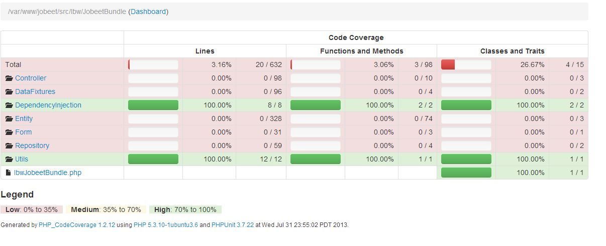
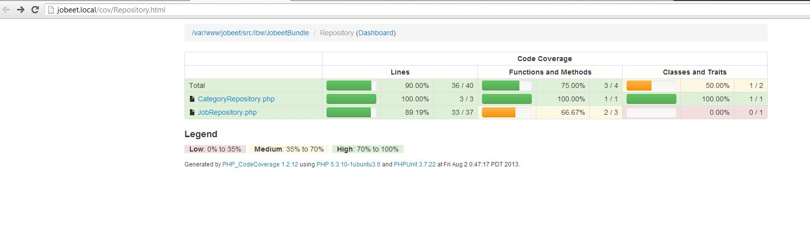
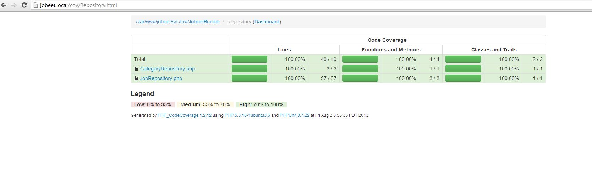

# 第八天：单元测试 #

*这一系列文章来源于Fabien Potencier，基于Symfony1.4编写的[Jobeet Tutirual](http://symfony.com/legacy/doc/jobeet?orm=Doctrine)。

## Symfony中的测试 ##

Symfony中有两种类型的测试：**单元测试**和**功能测试**。单元测试是验证每个方法或者函数是否能够按照预期的结果正确运行。每个单元测试应该尽可能不要对其它模块有依赖关系。而功能测试则是验证整个应用程序的行为是否正确。今天我们先来讲解单元测试，而明天我们将会讲解功能测试。

Symfony2集成了一个独立的测试库：**PHPUtil**，PHPUtil为我们提供了一个好用的测试框架。为了能够运行测试，我们需要安装*PHPUtil3.5.11*或者更新的版本。

> 如果你还没安装过**PHPUtil**，你可以按照下面进行安装：

>     sudo apt-get install phpunit
>     sudo pear channel-discover pear.phpunit.de
>     sudo pear channel-discover pear.symfony-project.com
>     sudo pear channel-discover components.ez.no
>     sudo pear channel-discover pear.symfony.com
>     sudo pear update-channels
>     sudo pear upgrade-all
>     sudo pear install pear.symfony.com/Yaml
>     sudo pear install --alldeps phpunit/PHPUnit
>     sudo pear install --force --alldeps phpunit/PHPUnit

不管是单元测试还是功能测试，它都是一个存放在包（bundle）里的*Tests/*子目录下的一个PHP类。如果你遵循了这个约定，那么我们就可以在终端下运行下面的命令来对我们的应用程序进行测试：

    phpunit -c app/

*-c*选项是告诉PHPUtil去*app/*目录下查找配置文件。如果你对PHPUtil的可选项感到好奇的话，你可以去查看*app/phputil.xml.dist*文件。

一个单元测试往往是只对一个指定的PHP类进行测试。现在我们来开始为*Jobeet::slugify()*方法写测试吧。

在*src/Ibw/JobeetBundle/Tests/Utils*目录下创建一个*JobeetTest.php*文件。通常来说，*Test/*下的目录结构应该和bundle目录下的结构是一样的，所以当我们为一个类进行单元测试时，我们需要把它放在*Tests/Utils/*目录下：

```PHP
// src/Ibw/JobeetBundle/Tests/Utils/JobeetTest.php
namespace Ibw\JobeetBundle\Tests\Utils;

use Ibw\JobeetBundle\Utils\Jobeet;
 
class JobeetTest extends \PHPUnit_Framework_TestCase
{
    public function testSlugify()
    {
        $this->assertEquals('sensio', Jobeet::slugify('Sensio'));
        $this->assertEquals('sensio-labs', Jobeet::slugify('sensio labs'));
        $this->assertEquals('sensio-labs', Jobeet::slugify('sensio labs'));
        $this->assertEquals('paris-france', Jobeet::slugify('paris,france'));
        $this->assertEquals('sensio', Jobeet::slugify(' sensio'));
        $this->assertEquals('sensio', Jobeet::slugify('sensio '));
    }
}
```

如果需要对指定的类进行单元测试的话，我们可以在命令后面带上参数：

    phpunit -c app/ src/Ibw/JobeetBundle/Tests/Utils/JobeetTest

如果测试运行通过，我们应该会得到下面的结果：

    PHPUnit 3.7.22 by Sebastian Bergmann.
    Configuration read from /var/www/jobeet/app/phpunit.xml.dist

    .

    Time: 0 seconds, Memory: 8.00Mb

    OK (1 test, 6 assertions)

我们可以查看PHPUtil文档来了解完整的[assertions](http://www.phpunit.de/manual/current/en/writing-tests-for-phpunit.html#writing-tests-for-phpunit.assertions)列表。

## 为新功能添加测试 ##

对一个空字符串使用*slug()*方法得到的结果是一个空字符串。我们可以测试一下，它可以得到正确的结果。但一个空字符串作为URL并不是什么好主意。我们来修改*slugify()*方法，使它处理空字符串的时候返回的结果是"*n-a*"。

我们可以先写一个测试，然后修改*slugify()*方法，一直到让测试能够通过，或者我们也可以使用其它类似的办法。虽然一开始编写的测试是不能被通过的，但先写好测试能让我们对预期要实现的代码有一个清晰的方法，这样我们就更加有信心确保编写出的代码的正确性。

```PHP
// src/Ibw/JobeetBundle/Tests/Utils/JobeetTest.php
// ...
 
$this->assertEquals('n-a', Jobeet::slugify(''));
 
// ...
```

现在我们再次运行测试，测试是不能通过的：

    PHPUnit 3.7.22 by Sebastian Bergmann.

    Configuration read from /var/www/jobeet/app/phpunit.xml.dist
 
    F
 
    Time: 0 seconds, Memory: 8.25Mb
 
    There was 1 failure:
 
    1    ) Ibw\JobeetBundle\Tests\Utils\JobeetTest::testSlugify
    Failed asserting that two strings are equal.
    --- Expected
    +++ Actual
    @@ @@
    -'n-a'
    +''
 
    /var/www/jobeet/src/Ibw/JobeetBundle/Tests/Utils/JobeetTest.php:13
 
    FAILURES!
    Tests: 1, Assertions: 5, Failures: 1.


现在我们来修改*Jobeet::slugify()*方法，在方法的开头添加下面的条件判断：

```PHP
// src/Ibw/JobeetBundle/Utils/Jobeet.php
// ...
 
static public function slugify($text)
{
    if (empty($text)) {
        return 'n-a';
    }

    // ...
}
```

现在测试能通过了，享受一下*green bar*带来的乐趣吧。

## 为Bug添加测试 ##

我们可以设想一下，当随着时间的推移，突然有一天你的一位用户给你反馈了一个奇怪的**bug**：有一些Job信息的链接被错误地转向到了**404页面**。经过了仔细的调查，你发现了其中的原因，因为有些Job数据中的*company*，*position*或者*location*的值是空的。

这可能吗？

于是你仔细地查看了数据库中的数据，而且数据表中的这几个列都是定义成**不为空（not null）**的，所以这是不可能的。

好吧，于是你再仔细想想... 有了，问题找到了。你发现当一个字符串只包含*非ASCII*字符时，*slugify()*方法会把它转成一个空字符串。找到了问题的原因是多么愉快的事情呀，于是你马上去修改*Jobeet.php*改正错误，不过这个主意很差。首先，我们应该来添加一个测试：

```PHP
// src/Ibw/JobeetBundle/Tests/Utils/JobeetTest.php
$this->assertEquals('n-a', Jobeet::slugify(' - '));
```

运行测试将不会通过。我们修改*Jobeet.php*，把空字符串判断移动到*slugify()*方法的末尾：

```PHP
// src/Ibw/JobeetBundle/Utils/Jobeet.php
static public function slugify($text)
{
    // ...
 
    if (empty($text))
    {
        return 'n-a';
    }
 
    return $text;
}
```

现在测试已经能通过了。虽然我们测试的覆盖率是100%，但*slugfiy()*有一个bug。

当写测试的时候，我们可能没有考虑到所有边界值测试用例的情况。当我们发现有Bug的时候，我们应该在纠正代码之前先编写测试。这是一件好事，这也意味着我们的代码会一次比一次好。

## 更好的*slugfiy*方法 ##

你可能不知道Symfony是法国人开发的，没关系，让我们来添加一个带法国口音（accent）的测试用例（看代码）吧：

```PHP
// src/Ibw/JobeetBundle/Tests/Utils/JobeetTest.php
$this->assertEquals('developpeur-web', Jobeet::slugify('Développeur Web'));
```

运行测试是不能通过的，*slugify()*方法把**é**替换成了**-**，而不是**e**。一个棘手的问题，这个问题被叫做“transliteration”。哈，幸运的是，如果你安装了*iconv*库的话，那么问题马上就能被解决了。用下面的代码替换*slugfiy()*方法：

```PHP
// src/Ibw/JobeetBundle/Utils/Jobeet.php
static public function slugify($text)
{
    // replace non letter or digits by -
    $text = preg_replace('#[^\\pL\d]+#u', '-', $text);
 
    // trim
    $text = trim($text, '-');
 
    // transliterate
    if (function_exists('iconv'))
    {
        $text = iconv('utf-8', 'us-ascii//TRANSLIT', $text);
    }
 
    // lowercase
    $text = strtolower($text);
 
    // remove unwanted characters
    $text = preg_replace('#[^-\w]+#', '', $text);
 
    if (empty($text))
    {
        return 'n-a';
    }
 
    return $text;
}
```

我们要记得把PHP文件保存为**UTF-8编码**，这个是Symfony的默认编码，*iconv*的*transliteration*使用的也是**UTF-8**。

修改测试文件，只有当*iconv*有效时才进行测试：

```PHP
// src/Ibw/JobeetBundle/Tests/Utils/JobeetTest.php
if (function_exists('iconv')) {
    $this->assertEquals('developpeur-web', Jobeet::slugify('Développeur Web'));
}
```

## 代码覆盖率 ##

当编写测试时，我们往往很容易忽略了代码，从而没对这些代码编写适当的测试。如果我们为程序添加了一个新功能或者仅仅只想要得到代码的覆盖率，我们可以使用*--coverage-html*选项来检查代码的覆盖率：

    phpunit --coverage-html=web/cov/ -c app/

> 只有安装了**XDebug**和所有的相关依赖之后，代码覆盖率检查才能够运行：
>    sudo apt-get install php5-xdebug

我们的*cov/index.html*看起来应该像下面那样：



我们需要记住的是，上面的结果仅仅说明所有代码都通过了单元测试，这仅仅意味着每一行都被执行过，不代表所有的边缘用例都被测试过。

## Doctrine单元测试 ##

对Doctrine进行单元测试是个比较复杂的任务，因为它需要连接数据库。我们已经在开发中使用过Doctrine了，我们来为它编写一个单元测试吧，这是个好习惯哦。

在教程的前几章内容中，我们介绍了可以通过设置来改变应用程序的环境。默认的，Symfony的所有测试都是运行在*Test*环境下，所以我们来为*Test*环境配置不同的数据库吧。

到*app/config/*目录下，复制一份*parameters.yml*并改名为*parameters_test.yml*。打开*parameters_test.yml*文件，修改数据库名为*jobeet_test*。这个文件需要被导入（import），所以我们把它加入到*config_test.yml*文件中：

```YAML
# app/config/config_test.yml
imports:
    - { resource: config_dev.yml }
    - { resource: parameters_test.yml }
// ...
```

## 测试Job实体 ##

首先我们需要在*Tests/Entiry/*目录下创建一个*JobTest.php*文件。

*setUp()*方法会在每次运行测试的时候对数据库进行操作（连接，插入数据）。首先，它会删除当前存在的数据库，然后重新创建数据库并从Fixtures中加载数据。这些操作能够帮助我们在测试环境中每次运行测试的时候都能够有相同的初始数据供测试使用。

```PHP
// src/Ibw/JobeetBundle/Tests/Entity/JobTest.php
namespace Ibw\JobeetBundle\Entity;
 
use Symfony\Bundle\FrameworkBundle\Test\WebTestCase;
use Ibw\JobeetBundle\Utils\Jobeet as Jobeet;
use Symfony\Bundle\FrameworkBundle\Console\Application;
use Symfony\Component\Console\Output\NullOutput;
use Symfony\Component\Console\Input\ArrayInput;
use Doctrine\Bundle\DoctrineBundle\Command\DropDatabaseDoctrineCommand;
use Doctrine\Bundle\DoctrineBundle\Command\CreateDatabaseDoctrineCommand;
use Doctrine\Bundle\DoctrineBundle\Command\Proxy\CreateSchemaDoctrineCommand;
 
class JobTest extends WebTestCase
{
    private $em;
    private $application;
 
    public function setUp()
    {
        static::$kernel = static::createKernel();
        static::$kernel->boot();
 
        $this->application = new Application(static::$kernel);
 
        // drop the database
        $command = new DropDatabaseDoctrineCommand();
        $this->application->add($command);
        $input = new ArrayInput(array(
            'command' => 'doctrine:database:drop',
            '--force' => true
        ));
        $command->run($input, new NullOutput());
 
        // we have to close the connection after dropping the database so we don't get "No database selected" error
        $connection = $this->application->getKernel()->getContainer()->get('doctrine')->getConnection();
        if ($connection->isConnected()) {
            $connection->close();
        }
 
        // create the database
        $command = new CreateDatabaseDoctrineCommand();
        $this->application->add($command);
        $input = new ArrayInput(array(
            'command' => 'doctrine:database:create',
        ));
        $command->run($input, new NullOutput());
 
        // create schema
        $command = new CreateSchemaDoctrineCommand();
        $this->application->add($command);
        $input = new ArrayInput(array(
            'command' => 'doctrine:schema:create',
        ));
        $command->run($input, new NullOutput());
 
        // get the Entity Manager
        $this->em = static::$kernel->getContainer()
            ->get('doctrine')
            ->getManager();
 
        // load fixtures
        $client = static::createClient();
        $loader = new \Symfony\Bridge\Doctrine\DataFixtures\ContainerAwareLoader($client->getContainer());
        $loader->loadFromDirectory(static::$kernel->locateResource('@IbwJobeetBundle/DataFixtures/ORM'));
        $purger = new \Doctrine\Common\DataFixtures\Purger\ORMPurger($this->em);
        $executor = new \Doctrine\Common\DataFixtures\Executor\ORMExecutor($this->em, $purger);
        $executor->execute($loader->getFixtures());
    }
 
    public function testGetCompanySlug()
    {
        $job = $this->em->createQuery('SELECT j FROM IbwJobeetBundle:Job j ')
            ->setMaxResults(1)
            ->getSingleResult();
 
        $this->assertEquals($job->getCompanySlug(), Jobeet::slugify($job->getCompany()));
    }
 
    public function testGetPositionSlug()
    {
        $job = $this->em->createQuery('SELECT j FROM IbwJobeetBundle:Job j ')
            ->setMaxResults(1)
            ->getSingleResult();
 
        $this->assertEquals($job->getPositionSlug(), Jobeet::slugify($job->getPosition()));
    }
 
    public function testGetLocationSlug()
    {
        $job = $this->em->createQuery('SELECT j FROM IbwJobeetBundle:Job j ')
            ->setMaxResults(1)
            ->getSingleResult();
 
        $this->assertEquals($job->getLocationSlug(), Jobeet::slugify($job->getLocation()));
    }
 
    public function testSetExpiresAtValue()
    {
        $job = new Job();
        $job->setExpiresAtValue();
 
        $this->assertEquals(time() + 86400 * 30, $job->getExpiresAt()->format('U'));
    }
 
    protected function tearDown()
    {
        parent::tearDown();
        $this->em->close();
    }
}
```

## 测试Repository类 ##

现在我们为JobRepository类编写测试，来看看我们在前几天内容中实现的方法有没有返回正确的值：

```PHP
// src/Ibw/JobeetBundle/Tests/Repository/JobRepositotyTest.php
namespace Ibw\JobeetBundle\Tests\Repository;
 
use Symfony\Bundle\FrameworkBundle\Test\WebTestCase;
use Symfony\Bundle\FrameworkBundle\Console\Application;
use Symfony\Component\Console\Output\NullOutput;
use Symfony\Component\Console\Input\ArrayInput;
use Doctrine\Bundle\DoctrineBundle\Command\DropDatabaseDoctrineCommand;
use Doctrine\Bundle\DoctrineBundle\Command\CreateDatabaseDoctrineCommand;
use Doctrine\Bundle\DoctrineBundle\Command\Proxy\CreateSchemaDoctrineCommand;
 
class JobRepositoryTest extends WebTestCase
{
    private $em;
    private $application;
 
    public function setUp()
    {
        static::$kernel = static::createKernel();
        static::$kernel->boot();
 
        $this->application = new Application(static::$kernel);
 
        // drop the database
        $command = new DropDatabaseDoctrineCommand();
        $this->application->add($command);
        $input = new ArrayInput(array(
            'command' => 'doctrine:database:drop',
            '--force' => true
        ));
        $command->run($input, new NullOutput());
 
        // we have to close the connection after dropping the database so we don't get "No database selected" error
        $connection = $this->application->getKernel()->getContainer()->get('doctrine')->getConnection();
        if ($connection->isConnected()) {
            $connection->close();
        }
 
        // create the database
        $command = new CreateDatabaseDoctrineCommand();
        $this->application->add($command);
        $input = new ArrayInput(array(
            'command' => 'doctrine:database:create',
        ));
        $command->run($input, new NullOutput());
 
        // create schema
        $command = new CreateSchemaDoctrineCommand();
        $this->application->add($command);
        $input = new ArrayInput(array(
            'command' => 'doctrine:schema:create',
        ));
        $command->run($input, new NullOutput());
 
        // get the Entity Manager
        $this->em = static::$kernel->getContainer()
            ->get('doctrine')
            ->getManager();
 
        // load fixtures
        $client = static::createClient();
        $loader = new \Symfony\Bridge\Doctrine\DataFixtures\ContainerAwareLoader($client->getContainer());
        $loader->loadFromDirectory(static::$kernel->locateResource('@IbwJobeetBundle/DataFixtures/ORM'));
        $purger = new \Doctrine\Common\DataFixtures\Purger\ORMPurger($this->em);
        $executor = new \Doctrine\Common\DataFixtures\Executor\ORMExecutor($this->em, $purger);
        $executor->execute($loader->getFixtures());
    }
 
    public function testCountActiveJobs()
    {
        $query = $this->em->createQuery('SELECT c FROM IbwJobeetBundle:Category c');
        $categories = $query->getResult();
 
        foreach($categories as $category) {
            $query = $this->em->createQuery('SELECT COUNT(j.id) FROM IbwJobeetBundle:Job j WHERE j.category = :category AND j.expires_at > :date');
            $query->setParameter('category', $category->getId());
            $query->setParameter('date', date('Y-m-d H:i:s', time()));
            $jobs_db = $query->getSingleScalarResult();
 
            $jobs_rep = $this->em->getRepository('IbwJobeetBundle:Job')->countActiveJobs($category->getId());
            // This test will verify if the value returned by the countActiveJobs() function
            // coincides with the number of active jobs for a given category from the database
            $this->assertEquals($jobs_rep, $jobs_db);
        }
    }
 
    public function testGetActiveJobs()
    {
        $query = $this->em->createQuery('SELECT c from IbwJobeetBundle:Category c');
        $categories = $query->getResult();
 
        foreach ($categories as $category) {
            $query = $this->em->createQuery('SELECT COUNT(j.id) from IbwJobeetBundle:Job j WHERE j.expires_at > :date AND j.category = :category');
            $query->setParameter('date', date('Y-m-d H:i:s', time()));
            $query->setParameter('category', $category->getId());
            $jobs_db = $query->getSingleScalarResult();
 
            $jobs_rep = $this->em->getRepository('IbwJobeetBundle:Job')->getActiveJobs($category->getId(), null, null);
            // This test tells if the number of active jobs for a given category from
            // the database is the same as the value returned by the function
            $this->assertEquals($jobs_db, count($jobs_rep));
        }
    }
 
    public function testGetActiveJob()
    {
        $query = $this->em->createQuery('SELECT j FROM IbwJobeetBundle:Job j WHERE j.expires_at > :date');
        $query->setParameter('date', date('Y-m-d H:i:s', time()));
        $query->setMaxResults(1);
        $job_db = $query->getSingleResult();
 
        $job_rep = $this->em->getRepository('IbwJobeetBundle:Job')->getActiveJob($job_db->getId());
        // If the job is active, the getActiveJob() method should return a non-null value
        $this->assertNotNull($job_rep);
 
        $query = $this->em->createQuery('SELECT j FROM IbwJobeetBundle:Job j WHERE j.expires_at < :date');         $query->setParameter('date', date('Y-m-d H:i:s', time()));
        $query->setMaxResults(1);
        $job_expired = $query->getSingleResult();
 
        $job_rep = $this->em->getRepository('IbwJobeetBundle:Job')->getActiveJob($job_expired->getId());
        // If the job is expired, the getActiveJob() method should return a null value
        $this->assertNull($job_rep);
    }
 
    protected function tearDown()
    {
        parent::tearDown();
        $this->em->close();
    }
}
```

为CategoryRepository类编写测试：

```PHP
// src/Ibw/JobeetBundle/Tests/Repository/CategoryRepositoryTest.php
namespace Ibw\JobeetBundle\Tests\Repository;
 
use Symfony\Bundle\FrameworkBundle\Test\WebTestCase;
use Symfony\Bundle\FrameworkBundle\Console\Application;
use Symfony\Component\Console\Output\NullOutput;
use Symfony\Component\Console\Input\ArrayInput;
use Doctrine\Bundle\DoctrineBundle\Command\DropDatabaseDoctrineCommand;
use Doctrine\Bundle\DoctrineBundle\Command\CreateDatabaseDoctrineCommand;
use Doctrine\Bundle\DoctrineBundle\Command\Proxy\CreateSchemaDoctrineCommand;
 
class CategoryRepositoryTest extends WebTestCase
{
    private $em;
    private $application;
 
    public function setUp()
    {
        static::$kernel = static::createKernel();
        static::$kernel->boot();
 
        $this->application = new Application(static::$kernel);
 
        // drop the database
        $command = new DropDatabaseDoctrineCommand();
        $this->application->add($command);
        $input = new ArrayInput(array(
            'command' => 'doctrine:database:drop',
            '--force' => true
        ));
        $command->run($input, new NullOutput());
 
        // we have to close the connection after dropping the database so we don't get "No database selected" error
        $connection = $this->application->getKernel()->getContainer()->get('doctrine')->getConnection();
        if ($connection->isConnected()) {
            $connection->close();
        }
 
        // create the database
        $command = new CreateDatabaseDoctrineCommand();
        $this->application->add($command);
        $input = new ArrayInput(array(
            'command' => 'doctrine:database:create',
        ));
        $command->run($input, new NullOutput());
 
        // create schema
        $command = new CreateSchemaDoctrineCommand();
        $this->application->add($command);
        $input = new ArrayInput(array(
            'command' => 'doctrine:schema:create',
        ));
        $command->run($input, new NullOutput());
 
        // get the Entity Manager
        $this->em = static::$kernel->getContainer()
            ->get('doctrine')
            ->getManager();
 
        // load fixtures
        $client = static::createClient();
        $loader = new \Symfony\Bridge\Doctrine\DataFixtures\ContainerAwareLoader($client->getContainer());
        $loader->loadFromDirectory(static::$kernel->locateResource('@IbwJobeetBundle/DataFixtures/ORM'));
        $purger = new \Doctrine\Common\DataFixtures\Purger\ORMPurger($this->em);
        $executor = new \Doctrine\Common\DataFixtures\Executor\ORMExecutor($this->em, $purger);
        $executor->execute($loader->getFixtures());
    }
 
    public function testGetWithJobs()
    {
        $query = $this->em->createQuery('SELECT c FROM IbwJobeetBundle:Category c LEFT JOIN c.jobs j WHERE j.expires_at > :date');
        $query->setParameter('date', date('Y-m-d H:i:s', time()));
        $categories_db = $query->getResult();
 
        $categories_rep = $this->em->getRepository('IbwJobeetBundle:Category')->getWithJobs();
        // This test verifies if the number of categories having active jobs, returned
        // by the getWithJobs() function equals the number of categories having active jobs from database
        $this->assertEquals(count($categories_rep), count($categories_db));
    }
 
    protected function tearDown()
    {
        parent::tearDown();
        $this->em->close();
    }
}
```

写完测试之后运行下面的命令，目的是为了生成所有方法的代码覆盖率：

    phpunit --coverage-html=web/cov/ -c app src/Ibw/JobeetBundle/Tests/Repository/

现在打开浏览器访问<http://jobeet.local/cov/Repository.html>，我们会看到*Repository Tests*的代码覆盖率并没有达到100%。



我们再来为JobRepository类添加一些测试来达到100%的覆盖率。
现在，我们的数据库中有三个Category数据，其中有两个Category中只有0行有效的Job数据，另外一个Category仅仅只有一行有效的Job数据。我们会对少于三行有效的Job数据的Category进行*$max*和*$offset*参数的测试。为了完成测试，我们用下面的代码替换*testGetActiveJobs()*函数中的*foreach*语句块：

```PHP
// src/Ibw/JobeetBundle/Tests/Repository/JobRepositoryTest.php
// ...
foreach ($categories as $category) {
    $query = $this->em->createQuery('SELECT COUNT(j.id) from IbwJobeetBundle:Job j WHERE j.expires_at > :date AND j.category = :category');
    $query->setParameter('date', date('Y-m-d H:i:s', time()));
    $query->setParameter('category', $category->getId());
    $jobs_db = $query->getSingleScalarResult();
 
    if($jobs_db > 2 ) {
        $jobs_rep = $this->em->getRepository('IbwJobeetBundle:Job')->getActiveJobs($category->getId(), 2);
        // This test tells if the number of returned active jobs is the one $max parameter requires
        $this->assertEquals(2, count($jobs_rep));
 
        $jobs_rep = $this->em->getRepository('IbwJobeetBundle:Job')->getActiveJobs($category->getId(), 2, 1);
        // We set the limit to 2 results, starting from the second job and test if the result is as expected
        $this->assertEquals(2, count($jobs_rep));
    }

    $jobs_rep = $this->em->getRepository('IbwJobeetBundle:Job')->getActiveJobs($category->getId(), null, null);
    // This test tells if the number of active jobs for a given category from
    // the database is the same as the value returned by the function
            $this->assertEquals($jobs_db, count($jobs_rep));
}
// ...
```

再次运行下面的命令：

    phpunit --coverage-html=web/cov/ -c app src/Ibw/JobeetBundle/Tests/Repository/

这次我们再去看看代码覆盖率，你会发现代码覆盖率已经完成到100%了。



今天我们就讲这些了，我们明天会讲解**功能测试**，那么我们明天见吧！

# 许可证 #

如果您需要转载的话，请尊重原作者的知识产权，您可以通过把如下链接放到您转载文章中的头部或者尾部，谢谢。

原文链接：<http://www.intelligentbee.com/blog/2013/08/14/symfony2-jobeet-day-8-the-unit-tests/>

您可以在以下链接查看该许可证的全文：


<http://creativecommons.org/licenses/by-nc/3.0/legalcode>
