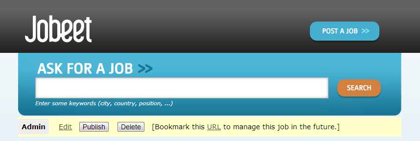
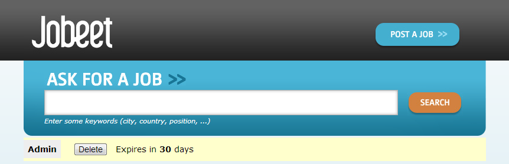

# 第十天：表单 #

*这一系列文章来源于Fabien Potencier，基于Symfony1.4编写的[Jobeet Tutirual](http://symfony.com/legacy/doc/jobeet?orm=Doctrine)。

从简单的**联系表单（contact form）**到带有很多个表单域的复杂表单，任何一个网站都会有表单的身影出现。对于一位*Web*开发者来说，编写表单是一个复杂而且乏味的工作之一：我们需要使用*HTML*代码把表单显示出来，然后需要为每个表单域添加验证规则，再把提交到服务器的表单值处理后保存到数据库中，（如果表单数据有错误）还需要把错误信息反馈给用户，而且还需要填充完用户没有错误的表单域等等...

在第三天的内容中，我门使用了`doctrine:generate:crud`命令为*Job*实体类生成了一个简单的*CRUD*控制器。同时也生成了一个*Job*表单，我们可以在*/src/Ibw/JobeetBundle/Form/JobType.php*文件中找到它。

## 自定义*Job*表单 ##

*Job*表单是一个学习如何自定义表单的一个好例子。我们来一步步地学习怎样进行自定义表单。

首先，修改*layout*中的*Post a Job*，让它能够正确转向到*Post*页面：

```HTML
<!-- src/Ibw/JobeetBundle/Resources/views/layout.html.twig -->
<a href="{{ path('ibw_job_new') }}">Post a Job</a>
```

修改*JobController::createAction()*中*ibw_job_show*的路由参数，让它能够匹配我们在第五天中修改过的*ibw_job_show*路由：

```PHP
// src/Ibw/JobeetBundle/Controller/JobController.php
// ...
 
public function createAction(Request $request)
{
    $entity  = new Job();
    $form = $this->createForm(new JobType(), $entity);
    $form->bind($request);
 
    if ($form->isValid()) {
        $em = $this->getDoctrine()->getManager();
 
        $em->persist($entity);
        $em->flush();
 
        return $this->redirect($this->generateUrl('ibw_job_show', array(
            'company' => $entity->getCompanySlug(),
            'location' => $entity->getLocationSlug(),
            'id' => $entity->getId(),
            'position' => $entity->getPositionSlug()
        )));
    }
 
    return $this->render('IbwJobeetBundle:Job:new.html.twig', array(
        'entity' => $entity,
        'form'   => $form->createView(),
    ));
}
 
// ...
```

*Doctrine*默认是按照数据表中的列（columns）来生成表单域的。但对于*Job*表单来说，有些表单域是不需要被最终用户（the end user）填写的。我们把*Job*表单编辑如下：

```PHP
// src/Ibw/JobeetBundle/Form/JobType.php
namespace Ibw\JobeetBundle\Form;
 
use Symfony\Component\Form\AbstractType;
use Symfony\Component\Form\FormBuilderInterface;
use Symfony\Component\OptionsResolver\OptionsResolverInterface;
 
class JobType extends AbstractType
{
    public function buildForm(FormBuilderInterface $builder, array $options)
    {
        $builder
            ->add('type')
            ->add('category')
            ->add('company')
            ->add('logo')
            ->add('url')
            ->add('position')
            ->add('location')
            ->add('description')
            ->add('how_to_apply')
            ->add('token')
            ->add('is_public')
            ->add('email')
        ;
    }
 
    public function setDefaultOptions(OptionsResolverInterface $resolver)
    {
        $resolver->setDefaults(array(
            'data_class' => 'Ibw\JobeetBundle\Entity\Job'
        ));
    }
 
    public function getName()
    {
        return 'job';
    }
}
```

表单的设置要比数据表的设置更加精确。举个例子来说吧，*email*列在数据表中仅仅只要求是*varchar*类型的，而表单中则需要验证*email*要有正确的格式。在*Symfony2*中，表单验证被隐含在实体对象之中（比如*Job*）。换句话说，我们的问题不是验证表单（form）是否有效，而是验证*Job*对象是否有效（表单提交后的数据会被一一映射成*Job*对象中的属性值）。为了做到这点，我们在*Resources/config*目录下创建一个*validation.yml*文件：

```YAML
# src/Ibw/JobeetBundle/Resources/config/validation.yml
Ibw\JobeetBundle\Entity\Job:
    properties:
        email:
            - NotBlank: ~
            - Email: ~
```

尽管*type*列（column）在数据表中是*varchar*类型的，但我们想限制它的取值只能在：*full time*，*part time*和*freelance*三个值之中。

```PHP
// src/Ibw/JobeetBundle/Form/JobType.php
// ...
use Ibw\JobeetBundle\Entity\Job;
 
class JobType extends AbstractType
{
    public function buildForm(FormBuilderInterface $builder, array $options)
    {
        $builder
            ->add('type', 'choice', array('choices' => Job::getTypes(), 'expanded' => true))
            // ...
    }
 
    // ...
 
}
```

为了让上面的代码能够运行，我们需要在*Job*实体中添加下面的代码：

```PHP
// src/Ibw/JobeetBundle/Entity/Job.php
// ...

public static function getTypes()
{
    return array('full-time' => 'Full time', 'part-time' => 'Part time', 'freelance' => 'Freelance');
}

public static function getTypeValues()
{
    return array_keys(self::getTypes());
}

// ...
```

表单利用*getTypes()*方法生成*Job*可以选择的类型，*getTypeValues()*方法被用来验证*type*表单域值的有效性。

```YAML
# src/Ibw/JobeetBundle/Resources/config/validation.yml
Ibw\JobeetBundle\Entity\Job:
    properties:
        type:
            - NotBlank: ~
            - Choice: { callback: getTypeValues }
        email:
            - NotBlank: ~
            - Email: ~
```

对于每个表单域，*Symfony*会为每个表单域自动生成一个*label*。我们能通过*label*选项来修改默认的*label*值：

```PHP
// src/Ibw/JobeetBundle/Form/JobType.php
public function buildForm(FormBuilderInterface $builder, array $options)
{
    $builder
        // ...
        ->add('logo', null, array('label' => 'Company logo'))
        // ...
        ->add('how_to_apply', null, array('label' => 'How to apply?'))
        // ...
        ->add('is_public', null, array('label' => 'Public?'))
        // ...
}
```

我们同样需要为剩下的表单域添加验证约束：

```YAML
# src/Ibw/JobeetBundle/Resources/config/validation.yml
Ibw\JobeetBundle\Entity\Job:
    properties:
        category:
            - NotBlank: ~
        type:
            - NotBlank: ~
            - Choice: {callback: getTypeValues}
        company:
            - NotBlank: ~
        position:
            - NotBlank: ~
        location:
            - NotBlank: ~
        description:
            - NotBlank: ~
        how_to_apply:
            - NotBlank: ~
        token:
            - NotBlank: ~
        email:
            - NotBlank: ~
            - Email: ~
        url:
            - Url: ~
```

这里约束*url*表单域值只能像*http://www.sitename.domain*或者*https://www.sitename.domain*这样的格式。

修改完*validation.yml*之后，我们需要清除*cache*。

## Symfony2处理上传文件 ##

为了能够在表单中处理上传文件，我们会给*Job*实体添加一个新的*file*属性：

```PHP
// src/Ibw/JobeetBundle/Entity/Job.php
// ...

public $file;

// ...
```

现在我们需要把*logo*文本域替换成文件域：

```PHP
// src/Ibw/JobeetBundle/Form/JobType.php
// ...
 
public function buildForm(FormBuilderInterface $builder, array $options)
{
    $builder
        // ...
        ->add('file', 'file', array('label' => 'Company logo', 'required' => false))
        // ...
}
// ...
```

为了确保上传的文件是图片，我们需要添加图片文件的验证：

```YAML
# src/Ibw/JobeetBundle/Resources/config/validation.yml
Ibw\JobeetBundle\Entity\Job:
    properties:
        # ...
        file:
            - Image: ~
```

当表单提交之后，文件域会被映射成*UploadedFile*类的一个实例。我们能通过给它一个参数来改变上传文件存放的位置。在这之后我们将会看到*Job*类的*logo*属性会被设置成上传文件的名字。

```PHP
// src/Ibw/JobeetBundle/Controller/JobController.php
// ...
 
public function createAction(Request $request)
{
    // ...

    if ($form->isValid()) {
        $em = $this->getDoctrine()->getManager();

        $entity->file->move(__DIR__.'/../../../../web/uploads/jobs', $entity->file->getClientOriginalName());
        $entity->setLogo($entity->file->getClientOriginalName());

        $em->persist($entity);
        $em->flush();

        return $this->redirect($this->generateUrl('ibw_job_show', array(
            'company' => $entity->getCompanySlug(),
            'location' => $entity->getLocationSlug(),
            'id' => $entity->getId(),
            'position' => $entity->getPositionSlug()
        )));
    }
    // ...
}
 
// ...
```

我们需要创存放*logo*图片的目录（*web/uploads/jobs*），并且确保这个目录是可以写的。

尽管能有这种方式处理文件的上传，但我们有更好的方式，那就是使用*Job*实体。

首先在*Job*实体中添加下面的代码：

```PHP
// src/Ibw/JobeetBundle/Entity/Job.php
class Job
{
    // ... 
    protected function getUploadDir()
    {
        return 'uploads/jobs';
    }
 
    protected function getUploadRootDir()
    {
        return __DIR__.'/../../../../web/'.$this->getUploadDir();
    }
 
    public function getWebPath()
    {
        return null === $this->logo ? null : $this->getUploadDir().'/'.$this->logo;
    }
 
    public function getAbsolutePath()
    {
        return null === $this->logo ? null : $this->getUploadRootDir().'/'.$this->logo;
    }
}
```

*logo*属性保存的值是上传文件的相对路径，它会被保存到数据库中。*getAbsolutePath()*方法返回的是上传文件的绝对路径，而*getWebPath()*方法是返回的是web路径，我们可以在模板中使用它。

我们会把数据库持久化和上传文件实现得具有“原子性（atomic）”：即如果不能成功保存*Job*实体到数据库或者文件上传失败，那么这两件事都将会失败（比如实体成功保存到数据库了，但文件上传失败了，这种情况属于操作失败，那么数据库保存的数据也必须撤销掉）。我们在当*Doctrine*成功保存实体后才把上传文件存在目录中。我们可以通过*Job*实体的*lifecycle callback*来完成这项操作。就像我们在第三天内容中所做的，我们在*Job.orm.yml*中添加*preUpload*，*upload* 和*removeUpload*回调方法：

```YAML
# src/Ibw/JobeetBundle/Resources/config/doctrine/Job.orm.yml
Ibw\JobeetBundle\Entity\Job:
    # ...
 
    lifecycleCallbacks:
        prePersist: [ preUpload, setCreatedAtValue, setExpiresAtValue ]
        preUpdate: [ preUpload, setUpdatedAtValue ]
        postPersist: [ upload ]
        postUpdate: [ upload ]
        postRemove: [ removeUpload ]
```

现在运行`generate:entities`命令为*Job*实体生成新的方法：

    php app/console doctrine:generate:entities IbwJobeetBundle

修改*Job.php*中新增的方法：

```PHP
// src/Ibw/JobeetBundle/Entity/Job.php
class Job
{
    // ...
 
    /**
     * @ORM\PrePersist
     */
    public function preUpload()
    {
         if (null !== $this->file) {
             $this->logo = uniqid().'.'.$this->file->guessExtension();
         }
    }
 
    /**
     * @ORM\PostPersist
     */
    public function upload()
    {
        if (null === $this->file) {
            return;
        }
 
        // If there is an error when moving the file, an exception will
        // be automatically thrown by move(). This will properly prevent
        // the entity from being persisted to the database on error
        $this->file->move($this->getUploadRootDir(), $this->logo);
 
        unset($this->file);
    }
 
    /**
     * @ORM\PostRemove
     */
    public function removeUpload()
    {
        if(file_exists($file)) {
            if ($file = $this->getAbsolutePath()) {
                unlink($file);
            }
        }    
    }
}
```

现在*Job*实体类已经能够完成我们需要的工作了：它会在保存到数据库之前生成一个唯一的文件名，保存数据库后就会把文件存放到目录下，当实体被删除的时候上传文件也将被删除。*Job*实体已经能够自动处理文件上传了，我们现在需要删除*JobController*中处理文件上传的代码：

```PHP
// src/Ibw/JobeetBundle/Controller/JobController.php
// ...
 
    public function createAction(Request $request)
    {
        $entity  = new Job();
        $form = $this->createForm(new JobType(), $entity);
        $form->bind($request);
 
        if ($form->isValid()) {
            $em = $this->getDoctrine()->getManager();
 
            $em->persist($entity);
            $em->flush();
 
            return $this->redirect($this->generateUrl('ibw_job_show', array(
                'company' => $entity->getCompanySlug(),
                'location' => $entity->getLocationSlug(),
                'id' => $entity->getId(),
                'position' => $entity->getPositionSlug()
            )));
        }
 
        return $this->render('IbwJobeetBundle:Job:new.html.twig', array(
            'entity' => $entity,
            'form'   => $form->createView(),
        ));
    }
 
// ...
```

## 表单模板 ##

我们已经完成了表单类的自定义，现在我们需要把它显示出来。修改*new.html.twig*模板：

```HTML
<!-- src/Ibw/JobeetBundle/Resources/views/Job/new.html.twig -->

 

 


    
        <ul class="error_list">
            
                <li>{{ error.messageTemplate|trans(error.messageParameters, 'validators') }}</li>
            
        </ul>
    


 

    {{ parent() }}
    <link rel="stylesheet" href="{{ asset('bundles/ibwjobeet/css/job.css') }}" type="text/css" media="all" />

 

    <h1>Job creation</h1>
    <form action="{{ path('ibw_job_create') }}" method="post" {{ form_enctype(form) }}>
        <table id="job_form">
            <tfoot>
                <tr>
                    <td colspan="2">
                        <input type="submit" value="Preview your job" />
                    </td>
                </tr>
            </tfoot>
            <tbody>
                <tr>
                    <th>{{ form_label(form.category) }}</th>
                    <td>
                        {{ form_errors(form.category) }}
                        {{ form_widget(form.category) }}
                    </td>
                </tr>
                <tr>
                    <th>{{ form_label(form.type) }}</th>
                    <td>
                        {{ form_errors(form.type) }}
                        {{ form_widget(form.type) }}
                    </td>
                </tr>
                <tr>
                    <th>{{ form_label(form.company) }}</th>
                    <td>
                        {{ form_errors(form.company) }}
                        {{ form_widget(form.company) }}
                    </td>
                </tr>
                <tr>
                    <th>{{ form_label(form.file) }}</th>
                    <td>
                        {{ form_errors(form.file) }}
                        {{ form_widget(form.file) }}
                    </td>
                </tr>
                <tr>
                    <th>{{ form_label(form.url) }}</th>
                    <td>
                        {{ form_errors(form.url) }}
                        {{ form_widget(form.url) }}
                    </td>
                </tr>
                <tr>
                    <th>{{ form_label(form.position) }}</th>
                    <td>
                        {{ form_errors(form.position) }}
                        {{ form_widget(form.position) }}
                    </td>
                </tr>
                <tr>
                    <th>{{ form_label(form.location) }}</th>
                    <td>
                        {{ form_errors(form.location) }}
                        {{ form_widget(form.location) }}
                    </td>
                </tr>
                <tr>
                    <th>{{ form_label(form.description) }}</th>
                    <td>
                        {{ form_errors(form.description) }}
                        {{ form_widget(form.description) }}
                    </td>
                </tr>
                <tr>
                    <th>{{ form_label(form.how_to_apply) }}</th>
                    <td>
                        {{ form_errors(form.how_to_apply) }}
                        {{ form_widget(form.how_to_apply) }}
                    </td>
                </tr>
                <tr>
                    <th>{{ form_label(form.token) }}</th>
                    <td>
                        {{ form_errors(form.token) }}
                        {{ form_widget(form.token) }}
                    </td>
                </tr>
                <tr>
                    <th>{{ form_label(form.is_public) }}</th>
                    <td>
                        {{ form_errors(form.is_public) }}
                        {{ form_widget(form.is_public) }}
                        <br /> Whether the job can also be published on affiliate websites or not.
                    </td>
                </tr>
                <tr>
                    <th>{{ form_label(form.email) }}</th>
                    <td>
                        {{ form_errors(form.email) }}
                        {{ form_widget(form.email) }}
                    </td>
                </tr>
            </tbody>
        </table>
    {{ form_end(form) }}

```

我们可以使用下面那一行代码来显示表单，但我们需要更多的自定义内容，所以我们选择手动来添加表单域。

```HTML
{{ form(form) }}
```

`form(form)`会显示每个表单域，而且还会带有*label*和*error*信息（如果有的话）。虽然这种方式简单，但是它不是很灵活。更多时候我们需要去自定义表单域的显示，以更好地控制它们的样式外观。

我们也使用一种叫做[form theming](http://symfony.com/doc/current/book/forms.html#form-theming)的技术来自定义[form errors](http://symfony.com/doc/current/cookbook/form/form_customization.html#customizing-error-output)的渲染。你可以参考[Symfony2的官方文档](http://symfony.com/doc/current/book/index.html)。

对*eidt.html.twig*做同样的修改：

```HTML
<!-- src/Ibw/JobeetBundle/Resources/views/Job/edit.html.twig -->

 

 


    
        <ul class="error_list">
            
                <li>{{ error.messageTemplate|trans(error.messageParameters, 'validators') }}</li>
            
        </ul>
    


 

    {{ parent() }}
    <link rel="stylesheet" href="{{ asset('bundles/ibwjobeet/css/job.css') }}" type="text/css" media="all" />

 

    <h1>Job edit</h1>
    <form action="{{ path('ibw_job_update', { 'id': entity.id }) }}" method="post" {{ form_enctype(edit_form) }}>
        <table id="job_form">
            <tfoot>
                <tr>
                    <td colspan="2">
                        <input type="submit" value="Preview your job" />
                    </td>
                </tr>
            </tfoot>
            <tbody>
                <tr>
                    <th>{{ form_label(edit_form.category) }}</th>
                    <td>
                        {{ form_errors(edit_form.category) }}
                        {{ form_widget(edit_form.category) }}
                    </td>
                </tr>
                <tr>
                    <th>{{ form_label(edit_form.type) }}</th>
                    <td>
                        {{ form_errors(edit_form.type) }}
                        {{ form_widget(edit_form.type) }}
                    </td>
                </tr>
                <tr>
                    <th>{{ form_label(edit_form.company) }}</th>
                    <td>
                        {{ form_errors(edit_form.company) }}
                        {{ form_widget(edit_form.company) }}
                    </td>
                </tr>
                <tr>
                    <th>{{ form_label(edit_form.file) }}</th>
                    <td>
                        {{ form_errors(edit_form.file) }}
                        {{ form(edit_form.file) }}
                    </td>
                </tr>
                <tr>
                    <th>{{ form_label(edit_form.url) }}</th>
                    <td>
                        {{ form_errors(edit_form.url) }}
                        {{ form_widget(edit_form.url) }}
                    </td>
                </tr>
                <tr>
                    <th>{{ form_label(edit_form.position) }}</th>
                    <td>
                        {{ form_errors(edit_form.position) }}
                        {{ form_widget(edit_form.position) }}
                    </td>
                </tr>
                <tr>
                    <th>{{ form_label(edit_form.location) }}</th>
                    <td>
                        {{ form_errors(edit_form.location) }}
                        {{ form_widget(edit_form.location) }}
                    </td>
                </tr>
                <tr>
                    <th>{{ form_label(edit_form.description) }}</th>
                    <td>
                        {{ form_errors(edit_form.description) }}
                        {{ form_widget(edit_form.description) }}
                    </td>
                </tr>
                <tr>
                    <th>{{ form_label(edit_form.how_to_apply) }}</th>
                    <td>
                        {{ form_errors(edit_form.how_to_apply) }}
                        {{ form_widget(edit_form.how_to_apply) }}
                    </td>
                </tr>
                <tr>
                    <th>{{ form_label(edit_form.token) }}</th>
                    <td>
                        {{ form_errors(edit_form.token) }}
                        {{ form_widget(edit_form.token) }}
                    </td>
                </tr>
                <tr>
                    <th>{{ form_label(edit_form.is_public) }}</th>
                    <td>
                        {{ form_errors(edit_form.is_public) }}
                        {{ form_widget(edit_form.is_public) }}
                        <br /> Whether the job can also be published on affiliate websites or not.
                    </td>
                </tr>
                <tr>
                    <th>{{ form_label(edit_form.email) }}</th>
                    <td>
                        {{ form_errors(edit_form.email) }}
                        {{ form_widget(edit_form.email) }}
                    </td>
                </tr>
            </tbody>
        </table>
    {{ form_end(edit_form) }}

```

## 表单行为（*Action*） ##

现在我们已经有了一个表单类（*JobType*）和一个利用它生成表单的模板。现在是时候让它能够做一点实际的行为了。*Job*表单被*JobController*中的四个方法所管理着：

* _newAction_：显示一个空表单用来创建一个新_job_
* _createAction_：处理表单（表单验证，表单填充）和利用用户提交的表单值实例化一个_Job_对象
* _editAction_：显示一个已存在_job_的编辑表单
* _updateAction_：处理表单（表单验证，表单填充）和利用用户提交的表单值更新已存在的_Job_对象

当你浏览*/job/new page*时，*createForm()*方法会实例化一个新的*job*表单实例，然后把这个表单实例传递给模板（*newAction*）。

当用户提交了表单（*createAction*），表单就绑定有用户提交的值（*bind($request)*方法），同时也会触发表单验证。一旦表单被绑定了，那么就可以使用*isValid()*方法验证表单是否有效：如果表单有效（返回true），那么*Job*数据就会被保存到数据库中（*$em->persist($entity)*），然后用户会被重定向到*Job*数据的预览页面；如果表单无效，那么*new.html.twig*模板会被重新渲染，而且表单还会自动填充用户提交上来的表单值，同时还会显示出错误信息。修改一个已存在的*Job*和这个过程很相似。*new*和*edit*行为唯一不同的是，需要被修改的*Job*对象是被作为*crateForm()*方法的第二个参数所使用。在模板中，这个对象的值的会被用来当做默认表单域的值。

我们也可以为*creation*表单定义默认的值。我们会传递一个预修改的*Job*对象给*createForm()*方法来设置*type*的默认值为*full-time*：

```PHP
// src/Ibw/JobeetBundle/Controller/jobController.php
// ...

public function newAction()
{
    $entity = new Job();
    $entity->setType('full-time');
    $form = $this->createForm(new JobType(), $entity);

    return $this->render('IbwJobeetBundle:Job:new.html.twig', array(
        'entity' => $entity,
        'form'   => $form->createView()
    ));
}

// ...
```

## 使用*Token*来保护表单 ##

现在一切都进展顺利，可是用户必须得填写*token*才能添加*Job*数据。通常来说，*token*应该是在这个*Job*数据被创建的时候自动生成的，我们不想让用户自己去提供这个唯一值的*token*。给*Job*实体的*prePersist lifecycleCallbacks*添加*setTokenValue*方法：

```YAML
# src/Ibw/JobeetBundle/Resources/config/doctrine/Job.orm.yml
# ...

lifecycleCallbacks:
    prePersist: [ setTokenValue, preUpload, setCreatedAtValue, setExpiresAtValue ]
     # ...
```

重新生成实体：

    php app/console doctrine:generate:entities IbwJobeetBundle

修改*Job*实体的*setTokenValue()*方法，给它添加生成*token*的逻辑代码：

```PHP
// src/Ibw/JobeetBundle/Entity/Job.php
// ...

public function setTokenValue()
{
    if(!$this->getToken()) {
        $this->token = sha1($this->getEmail().rand(11111, 99999));
    }
}

// ...
```

删除表单中的*token*域：

```PHP
// src/Ibw/JobeetBundle/Form/JobType.php
// ...
 
public function buildForm(FormBuilderInterface $builder, array $options)
{
    $builder
        ->add('category')
        ->add('type', 'choice', array('choices' => Job::getTypes(), 'expanded' => true))
        ->add('company')
        ->add('file', 'file', array('label' => 'Company logo', 'required' => false))
        ->add('url')
        ->add('position')
        ->add('location')
        ->add('description')
        ->add('how_to_apply', null, array('label' => 'How to apply?'))
        ->add('is_public', null, array('label' => 'Public?'))
        ->add('email')
    ;
}
 
// ...
```

删除*/new.html.twig*和*edit.html.twig*中的*token*域：

```HTML
<!-- src/Ibw/JobeetBundle/Resources/views/Job/new.html.twig -->
<!-- ... -->
<tr>
    <th>{{ form_label(form.token) }}</th>
    <td>
        {{ form_errors(form.token) }}
        {{ form_widget(form.token) }}
    </td>
</tr>
<!-- ... -->
```

```HTML
<!-- src/Ibw/JobeetBundle/Resources/views/Job/edit.html.twig -->
<!-- ... -->
<tr>
    <th>{{ form_label(edit_form.token) }}</th>
    <td>
        {{ form_errors(edit_form.token) }}
        {{ form(edit_form.token) }}
    </td>
</tr>
<!-- ... -->
```

删除*validation.yml*中的*token*域：

```YAML
# src/Ibw/JobeetBundle/Resources/config/validation.yml
# ...
    # ...
    token:
        - NotBlank: ~
```

还记得第二天内容中的用户*stories*吗，只有用户知道*Job*的*token*才能对该*Job*信息进行修改。很好，修改或者删除一个*Job*数据是多么得简单呀，你只需要去猜那个URL中的*token*是什么值就可以办到了，你说这不是很简单（keng ren）吗？。修改*Job*信息的访问URL类似于*/job/ID/edit*，这里的*ID*是*Job*的主键。

我们来修改路由，只有URL带上*token*才能修改和删除*Job*信息：

```YAML
# src/Ibw/JobeetBundle/Resources/config/routing/job.yml
# ...
 
ibw_job_edit:
    pattern:  /{token}/edit
    defaults: { _controller: "IbwJobeetBundle:Job:edit" }
 
ibw_job_update:
    pattern:  /{token}/update
    defaults: { _controller: "IbwJobeetBundle:Job:update" }
    requirements: { _method: post|put }
 
ibw_job_delete:
    pattern:  /{token}/delete
    defaults: { _controller: "IbwJobeetBundle:Job:delete" }
    requirements: { _method: post|delete }
```

现在修改*JobController*，使用*token*来代替*id*：

```PHP
// src/Ibw/JobeetBundle/Controller/JobController.php
// ...
class JobController extends Controller
{
    // ...
 
    public function editAction($token)
    {
        $em = $this->getDoctrine()->getManager();
 
        $entity = $em->getRepository('IbwJobeetBundle:Job')->findOneByToken($token);
 
        if (!$entity) {
            throw $this->createNotFoundException('Unable to find Job entity.');
        }
 
        $editForm = $this->createForm(new JobType(), $entity);
        $deleteForm = $this->createDeleteForm($token);
 
        return $this->render('IbwJobeetBundle:Job:edit.html.twig', array(
            'entity'      => $entity,
            'edit_form'   => $editForm->createView(),
            'delete_form' => $deleteForm->createView(),
        ));
    }   
 
    public function updateAction(Request $request, $token)
    {
        $em = $this->getDoctrine()->getManager();
 
        $entity = $em->getRepository('IbwJobeetBundle:Job')->findOneByToken($token);
 
        if (!$entity) {
            throw $this->createNotFoundException('Unable to find Job entity.');
        }
 
        $editForm   = $this->createForm(new JobType(), $entity);
        $deleteForm = $this->createDeleteForm($token);
 
        $editForm->bind($request);
 
        if ($editForm->isValid()) {
            $em->persist($entity);
            $em->flush();
 
            return $this->redirect($this->generateUrl('ibw_job_edit', array('token' => $token)));
        }
 
        return $this->render('IbwJobeetBundle:Job:edit.html.twig', array(
            'entity'      => $entity,
            'edit_form'   => $editForm->createView(),
            'delete_form' => $deleteForm->createView(),
        ));
    }
 
    public function deleteAction(Request $request, $token)
    {
        $form = $this->createDeleteForm($token);
        $form->bind($request);
 
        if ($form->isValid()) {
            $em = $this->getDoctrine()->getManager();
            $entity = $em->getRepository('IbwJobeetBundle:Job')->findOneByToken($token);
 
            if (!$entity) {
                throw $this->createNotFoundException('Unable to find Job entity.');
            }
 
            $em->remove($entity);
            $em->flush();
        }
 
        return $this->redirect($this->generateUrl('ibw_job'));
    }
 
    /**
     * Creates a form to delete a Job entity by id.
     *
     * @param mixed $id The entity id
     *
     * @return Symfony\Component\Form\Form The form
     */
    private function createDeleteForm($token)
    {
        return $this->createFormBuilder(array('token' => $token))
            ->add('token', 'hidden')
            ->getForm()
        ;
    }
}
```

修改*show.html.twig*模板中的*ibw_job_edit*路由参数：

```HTML
<!-- src/Ibw/JobeetBundle/Resources/views/Job/show.html.twig -->
<a href="{{ path('ibw_job_edit', {'token': entity.token}) }}">
```

修改*edit.html.twig*模板中的*ibw_job_update*路由：

```HTML
<!-- src/Ibw/JobeetBundle/Resources/views/Job/edit.html.twig -->
<form action="{{ path('ibw_job_update', {'token': entity.token}) }}" method="post" {{ form_enctype(edit_form) }}>
```

除了*job_show_user*路由外，其他和*Job*相关的路由都已经带上了*token*。现在，一个*Job*的URL样式应该是类似于这样的：*http://jobeet.local/job/TOKEN/edit*

## 预览页面 ##

预览页面和*Job*页面显示的内容是一样的。唯一不同的是，预览页面是通过*token*访问的，而不是通过*id*：

```YMAL
# src/Ibw/JobeetBundle/Resources/config/routing/job.yml
# ...
 
ibw_job_show:
    pattern:  /{company}/{location}/{id}/{position}
    defaults: { _controller: "IbwJobeetBundle:Job:show" }
    requirements:
        id:  \d+
 
ibw_job_preview:
    pattern:  /{company}/{location}/{token}/{position}
    defaults: { _controller: "IbwJobeetBundle:Job:preview" }
    requirements:
        token:  \w+
 
# ...
```

*previewAction()*（它和*showAction()*不同的是，它通过*token*来检索*job*，而不是通过*id*）：

```PHP
// src/Ibw/JobeetBundle/Controller/JobController.php
// ...
 
public function previewAction($token)
{
    $em = $this->getDoctrine()->getManager();

    $entity = $em->getRepository('IbwJobeetBundle:Job')->findOneByToken($token);

    if (!$entity) {
        throw $this->createNotFoundException('Unable to find Job entity.');
    }

    $deleteForm = $this->createDeleteForm($entity->getId());

    return $this->render('IbwJobeetBundle:Job:show.html.twig', array(
        'entity'      => $entity,
        'delete_form' => $deleteForm->createView(),
    ));
}
 
// ...
```

如果用户是通过带*token*的URL访问到页面的，那么我们就会在页面顶部显示一个*admin*栏。在*show.html.twig*的开头包含（include）一个模板，这个模板是用来显示*admin*栏的。同时删除底部的*edit*链接：

```HTML
<!-- src/Ibw/JobeetBundle/Resources/views/Job/show.html.twig -->
<!-- ... -->
 

    
        
    
 
 <!-- ... -->
 

```

然后创建*admin.html.twig*模板：

```HTML
<!-- src/Ibw/JobeetBundle/Resources/views/Job/admin.html.twig -->
<div id="job_actions">
    <h3>Admin</h3>
    <ul>
        
            <li><a href="{{ path('ibw_job_edit', { 'token': job.token }) }}">Edit</a></li>
            <li><a href="{{ path('ibw_job_edit', { 'token': job.token }) }}">Publish</a></li>
        
        <li>
            <form action="{{ path('ibw_job_delete', { 'token': job.token }) }}" method="post">
                {{ form_widget(delete_form) }}
                <button type="submit" onclick="if(!confirm('Are you sure?')) { return false; }">Delete</button>
            </form>
        </li>
        
            <li  class="expires_soon" >
                
                    Expired
                
                    Expires in <strong>{{ job.getDaysBeforeExpires }}</strong> days
                
 
                
                    - <a href="">Extend</a> for another 30 days
                
            </li>
        
            <li>
                [Bookmark this <a href="{{ url('ibw_job_preview', { 'token': job.token, 'company': job.companyslug, 'location': job.locationslug, 'position': job.positionslug }) }}">URL</a> to manage this job in the future.]
            </li>
        
    </ul>
</div>
```

这里虽然代码很多，但是都是简单并且容易理解的。

为了让模板的可读性更好，我们为*Job*实体添加一组简单的方法：

```PHP
// src/Ibw/JobeetBundle/Entity/Job.php
// ...

public function isExpired()
{
    return $this->getDaysBeforeExpires() < 0;
}

public function expiresSoon()
{
    return $this->getDaysBeforeExpires() < 5;    
}

public function getDaysBeforeExpires()
{
    return ceil(($this->getExpiresAt()->format('U') - time()) / 86400);
}

// ...
```

*admin*栏随着*Job*状态的不同显示出来的样式也会不同：





现在修改*JobController*中的*createAction()*和*updateAction()*，让它们重定向到预览页面：

```PHP
// src/Ibw/JobeetBundle/Controller/JobController.php
public function createAction(Request $request)
{
    // ...
    if ($form->isValid()) {
        // ... 
        return $this->redirect($this->generateUrl('ibw_job_preview', array(
            'company' => $entity->getCompanySlug(),
            'location' => $entity->getLocationSlug(),
            'token' => $entity->getToken(),
            'position' => $entity->getPositionSlug()
        )));
    }
    // ...
}
 
public function updateAction(Request $request, $token)
{
    // ...
    if ($editForm->isValid()) {
        // ... 
 
        return $this->redirect($this->generateUrl('ibw_job_preview', array(
            'company' => $entity->getCompanySlug(),
            'location' => $entity->getLocationSlug(),
            'token' => $entity->getToken(), 
            'position' => $entity->getPositionSlug()
        )));
    }
    // ...
}
```

就像我们之前所说的，如果你知道*token*或者你是*Jobeet*的管理员的话，你就有权可以修改一条*Job*信息。但是我们现在去访问*Job*页面的话，我们可以看到页面上有一个*Edit*链接，这样的用户体验让人感觉不好。我们来修改*show.html.twig*，删除*Edit*链接：

```HTML
<!-- src/Ibw/JobeetBundle/Resources/views/Job/show.html.twig -->
<div style="padding: 20px 0">
    <a href="{{ path('ibw_job_edit', { 'token': entity.token }) }}">
        Edit
    </a>
</div>
```

## *Job*激活和发布 ##

在*Job*页面的上部分有一个发布*Job*信息的链接，这个链接需要被指定到*publishAction()*上。我们先创建一个新的路由：

```YAML
# src/Ibw/JobeetBundle/Resources/config/routing/job.yml
# ...
 
ibw_job_publish:
    pattern:  /{token}/publish
    defaults: { _controller: "IbwJobeetBundle:Job:publish" }
    requirements: { _method: post }
```

现在我们来修改*Publish*链接（我们在这里使用表单，就像删除一个*Job*一样，它会发送一个*POST*请求）：

```HTML
<!-- src/Ibw/JobeetBundle/Resources/views/Job/admin.html.twig -->
<!-- ... -->
 

    <li><a href="{{ path('ibw_job_edit', { 'token': job.token }) }}">Edit</a></li>
    <li>
        <form action="{{ path('ibw_job_publish', { 'token': job.token }) }}" method="post">
            {{ form_widget(publish_form) }}
            <button type="submit">Publish</button>
        </form>
    </li>

 
<!-- ... -->
```

最后一步是创建*publishAction()*，同时修改*previewAction()*给模板传递一个*publish*表单：

```PHP
// src/Ibw/JobeetBundle/Controller/JobController.php
// ...
 
public function previewAction($token)
{
    // ...
 
    $deleteForm = $this->createDeleteForm($entity->getToken());
    $publishForm = $this->createPublishForm($entity->getToken());
 
    return $this->render('IbwJobeetBundle:Job:show.html.twig', array(
        'entity'      => $entity,
        'delete_form' => $deleteForm->createView(),
        'publish_form' => $publishForm->createView(),
    ));
}
 
public function publishAction(Request $request, $token)
{
    $form = $this->createPublishForm($token);
    $form->bind($request);
 
    if ($form->isValid()) {
        $em = $this->getDoctrine()->getManager();
        $entity = $em->getRepository('IbwJobeetBundle:Job')->findOneByToken($token);
 
        if (!$entity) {
            throw $this->createNotFoundException('Unable to find Job entity.');
        }
 
        $entity->publish();
        $em->persist($entity);
        $em->flush();
 
        $this->get('session')->getFlashBag()->add('notice', 'Your job is now online for 30 days.');
    }
 
    return $this->redirect($this->generateUrl('ibw_job_preview', array(
        'company' => $entity->getCompanySlug(),
        'location' => $entity->getLocationSlug(),
        'token' => $entity->getToken(),
        'position' => $entity->getPositionSlug()
    )));
}
 
private function createPublishForm($token)
{
    return $this->createFormBuilder(array('token' => $token))
        ->add('token', 'hidden')
        ->getForm()
    ;
}
 
// ...
```

*PublishAction()*方法使用的*publish()*可以在*Job*实体中定义：

```PHP
// src/Ibw/JobeetBundle/Entity
// ...
 
public function publish()
{
    $this->setIsActivated(true);
}
 
// ...
```

现在我们可以在浏览中测试*publish*功能了。

但现在我们依然还有问题需要去修正。那些未被激活的*Job*数据是不可以被访问到的，也不能出现在首页中。我们需要修改*JobRepository*：

```PHP
// src/Ibw/JobeetBundle/Repository/JobRepository.php
namespace Ibw\JobeetBundle\Repository;
use Doctrine\ORM\EntityRepository;
 
class JobRepository extends EntityRepository
{
    public function getActiveJobs($category_id = null, $max = null, $offset = null)
    {
        $qb = $this->createQueryBuilder('j')
            ->where('j.expires_at > :date')
            ->setParameter('date', date('Y-m-d H:i:s', time()))
            ->andWhere('j.is_activated = :activated')
            ->setParameter('activated', 1)
            ->orderBy('j.expires_at', 'DESC');
 
        if($max) {
            $qb->setMaxResults($max);
        }
 
        if($offset) {
            $qb->setFirstResult($offset);
        }
 
        if($category_id) {
            $qb->andWhere('j.category = :category_id')
                ->setParameter('category_id', $category_id);
        }
 
        $query = $qb->getQuery();
 
        return $query->getResult();
    }
 
    public function countActiveJobs($category_id = null)
    {
        $qb = $this->createQueryBuilder('j')
            ->select('count(j.id)')
            ->where('j.expires_at > :date')
            ->setParameter('date', date('Y-m-d H:i:s', time()))
            ->andWhere('j.is_activated = :activated')
            ->setParameter('activated', 1);
 
        if($category_id) {
            $qb->andWhere('j.category = :category_id')
                ->setParameter('category_id', $category_id);
        }
 
        $query = $qb->getQuery();
 
        return $query->getSingleScalarResult();
    }
 
    public function getActiveJob($id)
    {
        $query = $this->createQueryBuilder('j')
            ->where('j.id = :id')
            ->setParameter('id', $id)
            ->andWhere('j.expires_at > :date')
            ->setParameter('date', date('Y-m-d H:i:s', time()))
            ->andWhere('j.is_activated = :activated')
            ->setParameter('activated', 1)
            ->setMaxResults(1)
            ->getQuery();
 
        try {
            $job = $query->getSingleResult();
        } catch (\Doctrine\Orm\NoResultException $e) {
        $job = null;
          }
 
        return $job;
    }
}
```

修改*CategoryRepository*中的*getWithJobs()*方法：

```PHP
// src/Ibw/JobeetBundle/Repository/CategoryRepository.php
namespace Ibw\JobeetBundle\Repository;
use Doctrine\ORM\EntityRepository;
 
class CategoryRepository extends EntityRepository
{
    public function getWithJobs()
    {
        $query = $this->getEntityManager()
            ->createQuery('SELECT c FROM IbwJobeetBundle:Category c LEFT JOIN c.jobs j WHERE j.expires_at > :date AND j.is_activated = :activated')
            ->setParameter('date', date('Y-m-d H:i:s', time()))
            ->setParameter('activated', 1);
 
        return $query->getResult();
    }
}
```

好了，今天就这些了。你可以在浏览器中测试一下今天的实现的内容。所有未被激活的*Job*数据是不会显示到首页中的，即使你知道URL链接，它们也是不可以被访问到的。不过，如果你知道带*token*的URL的话就可以访问到，在这种情况下，*Job*预览页面顶部会显示出*admin*栏。

# 许可证 #

如果您需要转载的话，请尊重原作者的知识产权，您可以通过把如下链接放到您转载文章中的头部或者尾部，谢谢。

原文链接：<http://www.intelligentbee.com/blog/2013/08/16/symfony2-jobeet-day-10-the-forms/>

您可以在以下链接查看该许可证的全文：


<http://creativecommons.org/licenses/by-nc/3.0/legalcode>
