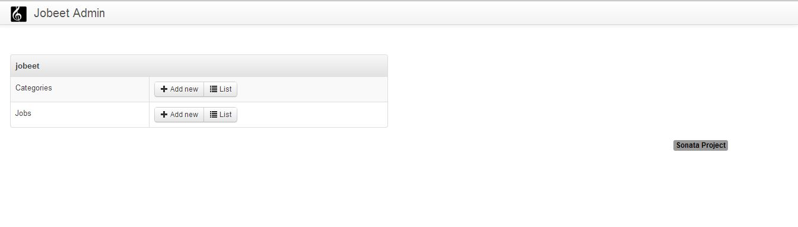

# 第十二天：后台管理工具包—Sonata Admin #

*这一系列文章来源于Fabien Potencier，基于Symfony1.4编写的[Jobeet Tutirual](http://symfony.com/legacy/doc/jobeet?orm=Doctrine)。

在第十一天中，我们给*Jobeet*添加了一些测试，这个应用程序已经完全能够被求职者（seekers）和职位发布者（posters）使用了。现在是时候考虑我们应用程序的*admin*部分了。今天还好有[Sonata Admin Bundle](http://sonata-project.org/bundles/admin/2-0/doc/index.html)的帮助，我们会使用它开发出一个完整*Jobeet*后台管理接口，（这个过程）用不到一个小时。

## 安装*Sonata Admin Bundle* ##

下载*SonataAdminBundle*和它的依赖到*vendor*目录下：

    php composer.phar require sonata-project/admin-bundle

为了安装最新版本的*SonataAdminBundle*和依赖，这个使用*作为输入。

    ibw@ubuntu:/var/www/jobeet$ php composer.phar require sonata-project/admin-bundle
    Please provide a version constraint for the sonata-project/admin-bundle requirement: *

我们同样需要安装*SonataDoctrineORMADminBundle*：

    php composer.phar require sonata-project/doctrine-orm-admin-bundle

现在我们需要声明新的*bundle*和依赖，修改*AppKernel.php*文件，添加下面代码到文件中：

```PHP
// app/AppKernel.php
// ...
public function registerBundles()
{
    $bundles = array(
        // ...
        new Sonata\AdminBundle\SonataAdminBundle(),
        new Sonata\BlockBundle\SonataBlockBundle(),
        new Sonata\jQueryBundle\SonatajQueryBundle(),
        new Sonata\DoctrineORMAdminBundle\SonataDoctrineORMAdminBundle(),
        new Knp\Bundle\MenuBundle\KnpMenuBundle(),
    );
}
 
// ...
```

修改*config.yml*，把下面代码添加到文件末尾：

```YAML
# app/config/config.yml
# ...
sonata_admin:
    title: Jobeet Admin
 
sonata_block:
    default_contexts: [cms]
    blocks:
        sonata.admin.block.admin_list:
            contexts:   [admin]
 
        sonata.block.service.text:
        sonata.block.service.action:
        sonata.block.service.rss:
```

在*config.yml*中找到*translator*键。如果它被注释掉了，那么请不要注释它。

```YAML
# app/config/config.yml
# ...
framework:
    # ...
    translator: { fallback: %locale%}
    # ...
#...
```

为了能让应用程序跑起来，我们需要导入（import）*admin routes*：

```YAML
# app/config/routing.yml
admin:
    resource: '@SonataAdminBundle/Resources/config/routing/sonata_admin.xml'
    prefix: /admin
 
_sonata_admin:
    resource: .
    type: sonata_admin
    prefix: /admin
 
# ...
```

现在我们从*bundle*中安装资源：

    php app/console assets:install web --symlink

别忘记把*cache*清除掉：

    php app/console cache:clear --env=dev
    php app/console cache:clear --env=prod

现在我们应该可以通过URL：<http://jobeet.local/app_dev.php/admin/dashboard>访问放到*admin*面板了。

> 以上的安装需要一步步进行，不然的话可能会报一些Bundle未找到的异常，还有就是目录必须是可写的。可能是SonataAdminBundle更新后的原因，如果在安装过程中遇到需要CoreBundle的问题，那么试着按照提示进行操作，但问题都不大。这里附上一个解决问题的链接：https://github.com/sonata-project/SonataAdminBundle/issues/1832

## *CRUD*控制器 ##

*CRUD*控制器包含了基础的*CRUD*操作。它是通过控制器名称映射到一个正确的*Admin*类的一个实例。我们可以按照项目的需求来重写任何或者所有的*action*。控制器使用*Admin*类来构造不同的操作。在控制器中可以通过*configuration*属性来访问*Admin*对象。

现在我们来为每个实体都创建一个控制器。首先是*Category*实体：

```PHP
// src/Ibw/JobeetBundle/Controller/CategoryAdminController.php
namespace Ibw\JobeetBundle\Controller;
 
use Sonata\AdminBundle\Controller\CRUDController as Controller;
 
class CategoryAdminController extends Controller
{
    // Your code will be here
}
```

然后是*Job*实体：

```PHP
// src/Ibw/JobeetBundle/Controller/JobAdminController.php
namespace Ibw\JobeetBundle\Controller;
 
use Sonata\AdminBundle\Controller\CRUDController as Controller;
 
class JobAdminController extends Controller
{
    // Your code will be here
}
```

## 创建*Admin*类 ##

*Admin*类代表的是模型的映射和管理页面（表单，列表，页面显示（show））的部分。为模型创建*Admin*类的最简单方式是去继承*Sonata\AdminBundle\Admin\Admin*类。我们会在*Admin*文件夹中创建*Admin*类。我们先创建*Admin*目录，然后为*Category*创建*Admin*类：

```PHP
// src/Ibw/JobeetBundle/Admin/CategoryAdmin.php
namespace Ibw\JobeetBundle\Admin;
 
use Sonata\AdminBundle\Admin\Admin;
use Sonata\AdminBundle\Datagrid\ListMapper;
use Sonata\AdminBundle\Datagrid\DatagridMapper;
use Sonata\AdminBundle\Validator\ErrorElement;
use Sonata\AdminBundle\Form\FormMapper;
 
class CategoryAdmin extends Admin
{
    // Your code will be here
}
```

```PHP
// src/Ibw/JobeetBundle/Admin/JobAdmin.php
namespace Ibw\JobeetBundle\Admin;
 
use Sonata\AdminBundle\Admin\Admin;
use Sonata\AdminBundle\Datagrid\ListMapper;
use Sonata\AdminBundle\Datagrid\DatagridMapper;
use Sonata\AdminBundle\Validator\ErrorElement;
use Sonata\AdminBundle\Form\FormMapper;
use Sonata\AdminBundle\Show\ShowMapper;
use Ibw\JobeetBundle\Entity\Job;
 
class JobAdmin extends Admin
{
    // Your code will be here
}
```

现在我们需要把每个*admin*类添加到*services.yml*配置文件中：

```YAML
# src/Ibw/JobeetBundle/Resources/config/services.yml
services:
    ibw.jobeet.admin.category:
        class: Ibw\JobeetBundle\Admin\CategoryAdmin
        tags:
            - { name: sonata.admin, manager_type: orm, group: jobeet, label: Categories }
        arguments:
            - ~
            - Ibw\JobeetBundle\Entity\Category
            - 'IbwJobeetBundle:CategoryAdmin'
 
    ibw.jobeet.admin.job:
        class: Ibw\JobeetBundle\Admin\JobAdmin
        tags:
            - { name: sonata.admin, manager_type: orm, group: jobeet, label: Jobs }
        arguments:
            - ~
            - Ibw\JobeetBundle\Entity\Job
            - 'IbwJobeetBundle:JobAdmin'
```

现在我们可以在管理面板页看到*Jobeet*分组了，还有*Job*和*Category*模块（modules），它们都有各自的*Add new*和*List*链接。



## 配置*Admin*类 ##

如果我们去点击*Add new*或者*List*链接，我们什么都看不到。那是因为我们还没有为*list*和*form*配置字段。我们来做个基础的配置，先从*Category*开始：

```PHP
// src/Ibw/JobeetBundle/Admin/CategoryAdmin.php
namespace Ibw\JobeetBundle\Admin;
 
use Sonata\AdminBundle\Admin\Admin;
use Sonata\AdminBundle\Datagrid\ListMapper;
use Sonata\AdminBundle\Datagrid\DatagridMapper;
use Sonata\AdminBundle\Validator\ErrorElement;
use Sonata\AdminBundle\Form\FormMapper;
 
class CategoryAdmin extends Admin
{
    // setup the default sort column and order
    protected $datagridValues = array(
        '_sort_order' => 'ASC',
        '_sort_by' => 'name'
    );
 
    protected function configureFormFields(FormMapper $formMapper)
    {
        $formMapper
            ->add('name')
            ->add('slug')
        ;
    }
 
    protected function configureDatagridFilters(DatagridMapper $datagridMapper)
    {
        $datagridMapper
            ->add('name')
        ;
    }
 
    protected function configureListFields(ListMapper $listMapper)
    {
        $listMapper
            ->addIdentifier('name')
            ->add('slug')
        ;
    }
}
```

现在是*Job*：

```PHP
// src/Ibw/JobeetBundle/Admin/JobAdmin.php
namespace Ibw\JobeetBundle\Admin;
 
use Sonata\AdminBundle\Admin\Admin;
use Sonata\AdminBundle\Datagrid\ListMapper;
use Sonata\AdminBundle\Datagrid\DatagridMapper;
use Sonata\AdminBundle\Validator\ErrorElement;
use Sonata\AdminBundle\Form\FormMapper;
use Sonata\AdminBundle\Show\ShowMapper;
use Ibw\JobeetBundle\Entity\Job;
 
class JobAdmin extends Admin
{
    // setup the defaut sort column and order
    protected $datagridValues = array(
        '_sort_order' => 'DESC',
        '_sort_by' => 'created_at'
    );
 
    protected function configureFormFields(FormMapper $formMapper)
    {
        $formMapper
            ->add('category')
            ->add('type', 'choice', array('choices' => Job::getTypes(), 'expanded' => true))
            ->add('company')
            ->add('file', 'file', array('label' => 'Company logo', 'required' => false))
            ->add('url')
            ->add('position')
            ->add('location')
            ->add('description')
            ->add('how_to_apply')
            ->add('is_public')
            ->add('email')
            ->add('is_activated')
        ;
    }
 
    protected function configureDatagridFilters(DatagridMapper $datagridMapper)
    {
        $datagridMapper
            ->add('category')
            ->add('company')
            ->add('position')
            ->add('description')
            ->add('is_activated')
            ->add('is_public')
            ->add('email')
            ->add('expires_at')
        ;
    }
 
    protected function configureListFields(ListMapper $listMapper)
    {
        $listMapper
            ->addIdentifier('company')
            ->add('position')
            ->add('location')
            ->add('url')
            ->add('is_activated')
            ->add('email')
            ->add('category')
            ->add('expires_at')
            ->add('_action', 'actions', array(
                'actions' => array(
                    'view' => array(),
                    'edit' => array(),
                    'delete' => array(),
                )
            ))
        ;
    }
 
    protected function configureShowField(ShowMapper $showMapper)
    {
        $showMapper
            ->add('category')
            ->add('type')
            ->add('company')
            ->add('webPath', 'string', array('template' => 'IbwJobeetBundle:JobAdmin:list_image.html.twig'))
            ->add('url')
            ->add('position')
            ->add('location')
            ->add('description')
            ->add('how_to_apply')
            ->add('is_public')
            ->add('is_activated')
            ->add('token')
            ->add('email')
            ->add('expires_at')
        ;
    }
}
```

对于*show*操作，我们使用自定义的模板来显示公司的*logo*属性：

```HTML
<!-- src/Ibw/JobeetBundle/Resources/views/JobAdmin/list_image.html.twig -->
<tr>
    <th>Logo</th>
    <td></td>
</tr>
```

通过上面的操作，我们为*Job*和*Category*创建了基础的管理模块。我们可以发现它们有以下功能：

* 列表分页显示
* 列表可以排序
* 列表可以过滤
* 可以创建，编辑，删除对象
* 可以批量选择对象并进行删除
* 拥有表单验证
* 快速反馈给用户的*flash*信息提示

## 批量操作（Batch Actions） ##

批量操作是对一个被选择的模型对象集合（所有的对象或者只是它们中的一个子集）进行的操作。我们能够方便地为列表页面添加自定义的批量操作。*delete*操作默认就允许我们一次删除多个实体。

为了添加新的批量操作，我们需要重写*Admin*类的*getBatchActions()*方法。我们来添加一个批量处理*extend*的操作：

```PHP
// src/Ibw/JobeetBundle/Admin/JobAdmin.php
// ...
 
public function getBatchActions()
{
    // retrieve the default (currently only the delete action) actions
    $actions = parent::getBatchActions();
 
    // check user permissions
    if($this->hasRoute('edit') && $this->isGranted('EDIT') && $this->hasRoute('delete') && $this->isGranted('DELETE')) {
        $actions['extend'] = array(
            'label'            => 'Extend',
            'ask_confirmation' => true // If true, a confirmation will be asked before performing the action
        );
 
    }
 
    return $actions;
}
```

*extend*批量操作的核心逻辑在*JobAdminController::batchActionExtend()*方法中。*batchActionExtend()*方法有一个查询参数，通过这个查询参数我们可以检索出被选择的模型对象。如果出于某种原因，你可能不需要通过默认的选择方法（selection method）来进行批量操作（例如，你可以选择在模板级别上进行细粒度的模型选择），那么可以传递一个值为null的查询参数。

```PHP
// src/Ibw/JobeetBundle/Controller/JobAdminController.php
namespace Ibw\JobeetBundle\Controller;
 
use Sonata\AdminBundle\Controller\CRUDController as Controller;
use Sonata\DoctrineORMAdminBundle\Datagrid\ProxyQuery as ProxyQueryInterface;
use Symfony\Component\HttpFoundation\RedirectResponse;
use Symfony\Component\Security\Core\Exception\AccessDeniedException;
 
class JobAdminController extends Controller
{
    public function batchActionExtend(ProxyQueryInterface $selectedModelQuery)
    {
        if ($this->admin->isGranted('EDIT') === false || $this->admin->isGranted('DELETE') === false) {
            throw new AccessDeniedException();
        }
 
        $modelManager = $this->admin->getModelManager();
 
        $selectedModels = $selectedModelQuery->execute();
 
        try {
            foreach ($selectedModels as $selectedModel) {
                $selectedModel->extend();
                $modelManager->update($selectedModel);
            }
        } catch (\Exception $e) {
            $this->get('session')->getFlashBag()->add('sonata_flash_error', $e->getMessage());
 
            return new RedirectResponse($this->admin->generateUrl('list',$this->admin->getFilterParameters()));
        }
 
        $this->get('session')->getFlashBag()->add('sonata_flash_success',  sprintf('The selected jobs validity has been extended until %s.', date('m/d/Y', time() + 86400 * 30)));
 
        return new RedirectResponse($this->admin->generateUrl('list',$this->admin->getFilterParameters()));
    }
}
```

我们再来添加一个批量删除所有在60天内仍未被激活的*Job*数据的操作。对于这个操作，我们不需要在列表中选择任何的*Job*数据，因为在这个操作的逻辑中会去检索符合条件的记录并删除它们。

```PHP
// /home/happen/php_pro/jobeet/JobAdmin.php
// ...

public function getBatchActions()
{
    // retrieve the default (currently only the delete action) actions
    $actions = parent::getBatchActions();

    // check user permissions
    if($this->hasRoute('edit') && $this->isGranted('EDIT') && $this->hasRoute('delete') && $this->isGranted('DELETE')){
        $actions['extend'] = array(
            'label'            => 'Extend',
            'ask_confirmation' => true // If true, a confirmation will be asked before performing the action
        );

        $actions['deleteNeverActivated'] = array(
            'label'            => 'Delete never activated jobs',
            'ask_confirmation' => true // If true, a confirmation will be asked before performing the action
        );
    }

    return $actions;
}
```

除了创建*batchActionDeleteNeverActivated*操作外，我们还会创建一个*JobAdminController:: batchActionDeleteNeverActivatedIsRelevant()*方法，这个方法需要得到确认之后才能够执行，以确保用户真的是要进行这个操作（在我们的这个例子中它总是返回true，因为选择需要被删除的*Job*数据的逻辑在*JobRepository::cleanup()*方法中）。

```PHP
// src/Ibw/JobeetBundle/Controller/JobAdminController.php
// ...
 
public function batchActionDeleteNeverActivatedIsRelevant()
{
    return true;
}
 
public function batchActionDeleteNeverActivated()
{
    if ($this->admin->isGranted('EDIT') === false || $this->admin->isGranted('DELETE') === false) {
        throw new AccessDeniedException();
    }
 
    $em = $this->getDoctrine()->getManager();
    $nb = $em->getRepository('IbwJobeetBundle:Job')->cleanup(60);
 
    if ($nb) {
        $this->get('session')->getFlashBag()->add('sonata_flash_success',  sprintf('%d never activated jobs have been deleted successfully.', $nb));
    } else {
        $this->get('session')->getFlashBag()->add('sonata_flash_info',  'No job to delete.');
    }
 
    return new RedirectResponse($this->admin->generateUrl('list',$this->admin->getFilterParameters()));
}
```

今天我们就先到这了！明天我们来看看怎么样为管理员部分添加用户名（username）和密码（password），同时也会讨论*Symfony*的安全机制。

# 许可证 #

如果您需要转载的话，请尊重原作者的知识产权，您可以通过把如下链接放到您转载文章中的头部或者尾部，谢谢。

原文链接：<http://www.intelligentbee.com/blog/2013/08/18/symfony2-jobeet-day-12-sonata-admin-bundle/>

您可以在以下链接查看该许可证的全文：


<http://creativecommons.org/licenses/by-nc/3.0/legalcode>
