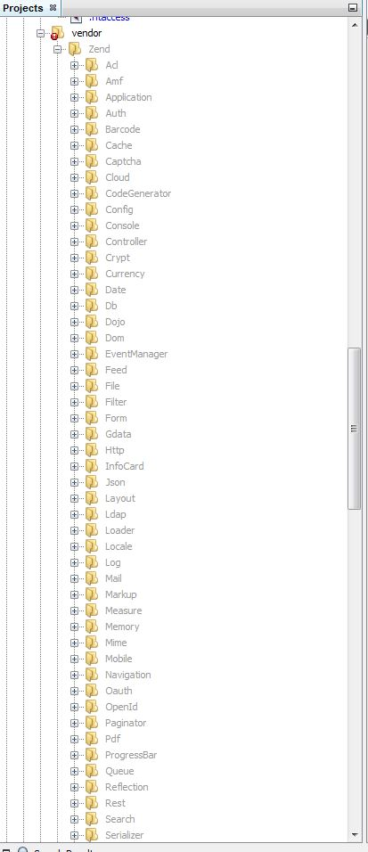

# 第十七天：搜索 #

*这一系列文章来源于Fabien Potencier，基于Symfony1.4编写的[Jobeet Tutirual](http://symfony.com/legacy/doc/jobeet?orm=Doctrine)。

在第十四天中，我们给Jobeet添加了订阅功能，用户能够实时地接收到最新发布的信息了。为了让Jobeet拥有更好的用户体验，今天我们就来给Jobeet添加新的功能：搜索引擎。

## Zend Lucene ##

今天，我们就要给Jobeet添加搜索功能啦。对于Zend Framework，它提供了一个强大的库，叫做[Zend Lucene](http://framework.zend.com/manual/en/zend.search.lucene.html)，它也是著名的Java Lucene项目的一部分。我们的任务不是要给Jobeet写一个搜索引擎，因为那实在是个复杂的任务，所以我们会直接使用Zend Lucene。

我们今天的教程不是讲怎么样使用Zend Lucene库，而是讲怎么样把Zend Lucene集成到Jobeet网站中，或者更广泛地说，是讲怎么样在Symfony中集成其它的第三方库。如果你想要学习更多关于Zend Lucene的相关技术，你可以查阅[Zend Lucene](http://framework.zend.com/manual/en/zend.search.lucene.html)的文档。

## 安装和配置Zend Framework ##

Zend Lucene是Zend Framework的一部分。我们会把Zend Framework放在Symfony的*vendor/*目录下。首先，我们下载Zend Framework，然后把它解压出来，你会看到有*library/Zend/*目录，然后把它复制到Symfony项目中的*vendor/*目录下。需要注意的是，2.*版本的Zend Framework没有集成Lucene库，所以你不要去下载它们。

> 下面的内容已经使用1.12.3版本的Zend Framework测试过了。



你可以删除一些文件来清理一下目录，但请不要删除下面这几个文件和目录：

* Exception.php
* Loader/
* Loader.php
* Search/

然后在*autoload.php*文件中添加下面的代码，目的是为了提供一种简单的方式来注册*Zend autoloader*。

```PHP
// app/autoload.php
// ...

set_include_path(__DIR__.'/../vendor'.PATH_SEPARATOR.get_include_path());
require_once __DIR__.'/../vendor/Zend/Loader/Autoloader.php';
Zend_Loader_Autoloader::getInstance();

return $loader;
```

## 索引 ##

Jobeet搜索引擎要能够返回和用户输入关键字相匹配的信息。在实现搜索功能之前，我们需要为*Job*建立索引。对于Jobeet项目来说，我们会把索引文件放在*/web/data/*目录下，这个目录我们待会就来创建。

Zend Lucene提供了两个方法来检索索引，使用哪个方法则取决于索引是否已存在。现在，我们给*Job*实体创建一个助手方法，这个方法能够返回一个已存的索引或者是返回一个新建的索引给我们：

```PHP
// src/Ibw/JobeetBundle/Entity/Job.php
// ...
 
class Job
{
    // ...
 
    static public function getLuceneIndex()
    {
        if (file_exists($index = self::getLuceneIndexFile())) {
            return \Zend_Search_Lucene::open($index);
        }
 
        return \Zend_Search_Lucene::create($index);
    }
 
    static public function getLuceneIndexFile()
    {
        return __DIR__.'/../../../../web/data/job.index';
    }
}
```

一个job被创建或者被更新时，它的索引也必须被更新。修改ORM文件，使得当一个job被序列化到数据库中时，同时也更新它的索引：

```YAML
# src/Ibw/JobeetBundle/Resources/config/doctrine/Job.orm.yml
# ...
    # ...
    lifecycleCallbacks:
        # ...
        postPersist: [ upload, updateLuceneIndex ]
        postUpdate: [ upload, updateLuceneIndex ]
        # ...
```

现在运行`generate:entities`命令，它会在*Job*类中生成*updateLuceneIndex()*方法：

    php app/console doctrine:generate:entities IbwJobeetBundle

然后修改*updateLuceneIndex()*方法来处理实际的操作：

```PHP
// src/Ibw/JobeetBundle/Entity/Job.php
class Job
{
    // ...
 
    public function updateLuceneIndex()
    {
        $index = self::getLuceneIndex();
 
        // remove existing entries
        foreach ($index->find('pk:'.$this->getId()) as $hit)
        {
          $index->delete($hit->id);
        }
 
        // don't index expired and non-activated jobs
        if ($this->isExpired() || !$this->getIsActivated())
        {
          return;
        }
 
        $doc = new \Zend_Search_Lucene_Document();
 
        // store job primary key to identify it in the search results
        $doc->addField(\Zend_Search_Lucene_Field::Keyword('pk', $this->getId()));
 
        // index job fields
        $doc->addField(\Zend_Search_Lucene_Field::UnStored('position', $this->getPosition(), 'utf-8'));
        $doc->addField(\Zend_Search_Lucene_Field::UnStored('company', $this->getCompany(), 'utf-8'));
        $doc->addField(\Zend_Search_Lucene_Field::UnStored('location', $this->getLocation(), 'utf-8'));
        $doc->addField(\Zend_Search_Lucene_Field::UnStored('description', $this->getDescription(), 'utf-8'));
 
        // add job to the index
        $index->addDocument($doc);
        $index->commit();
    }
}
```

因为Zend Lucene不能够更新已存在的索引，所以我们需要先删除已存在的索引，然后再添加新的索引。

索引job的过程很简单：保存主键是为以后搜索job信息提供了参考，其他的主列（main columns）（position，company，location和description）同样能够被索引，但是它们没有被保存在索引文件中，因为我们会使用真实的对象来显示这些主列（看上面的代码）。我们同样需要创建*deleteLuceneIndex()*方法来移除已经被删除的job数据的索引。就像我们之前的更新操作一样，我们来添加删除操作。我们在ORM文件的*postRemove*部分添加*deleteLuceneIndex()*方法：

```YAML
# src/Ibw/JobeetBundle/Resources/config/doctrine/Job.orm.yml
# ...
    # ...
    lifecycleCallbacks:
        # ...
        postRemove: [ removeUpload, deleteLuceneIndex ]
```

再次运行命令来生成实体：

    php app/console doctrine:generate:entities IbwJobeetBundle

现在修改*Job.php*，实现*deleteLuceneIndex()*方法：

```PHP
// src/Ibw/JobeetBundle/Entity/Job.php
class Job
{
    // ...
 
    public function deleteLuceneIndex()
    {
        $index = self::getLuceneIndex();
 
        foreach ($index->find('pk:'.$this->getId()) as $hit) {
            $index->delete($hit->id);
        }
    }
}
```

不管是通过命令行修改索引文件还是通过web修改索引文件，你都必须修改索引目录的权限，因此这取决于你的配置：

    chmod -R 777 web/data

现在我们可以重新加载fixture数据了，这样fixture数据就能被索引了：

     php app/console doctrine:fixtures:load

## 搜索 ##

实现搜索简直就是小菜一碟嘛。首先，我们创建路由：

```YAML
# src/Ibw/JobeetBundle/Resources/config/routing/job.yml
# ...
 
ibw_job_search:
    pattern: /search
    defaults: { _controller: "IbwJobeetBundle:Job:search" }
```

添加action：

```PHP
// src/Ibw/JobeetBundle/Controller/JobController.php
namespace Ibw\JobeetBundle\Controller;
 
use Symfony\Component\HttpFoundation\Request;
use Symfony\Bundle\FrameworkBundle\Controller\Controller;
use Ibw\JobeetBundle\Entity\Job;
use Ibw\JobeetBundle\Form\JobType;
 
class JobController extends Controller
{
    // ...
 
    public function searchAction(Request $request)
    {
        $em = $this->getDoctrine()->getManager();
        $query = $this->getRequest()->get('query');
 
        if(!$query) {
            return $this->redirect($this->generateUrl('ibw_job'));
        }
 
        $jobs = $em->getRepository('IbwJobeetBundle:Job')->getForLuceneQuery($query);
 
        return $this->render('IbwJobeetBundle:Job:search.html.twig', array('jobs' => $jobs));
    }
}
```

在*searchAction()*中，如果请求的*query*不存在或者为空的话，那么用户就会转向到*JobController::indexAction()*方法。

视图模板也是简单明了的：

```HTML
<!-- src/Ibw/JobeetBundle/Resources/views/Job/search.html.twig -->

 

    {{ parent() }}
    <link rel="stylesheet" href="{{ asset('bundles/ibwjobeet/css/jobs.css') }}" type="text/css" media="all" />

 

    <div id="jobs">
        
    </div>

```

执行搜索的逻辑在*getForLuceneQuery()*方法中：

```PHP
// src/Ibw/JobeetBundle/Repository/JobRepository.php
namespace Ibw\JobeetBundle\Repository;
 
use Doctrine\ORM\EntityRepository;
use Ibw\JobeetBundle\Entity\Job;
 
class JobRepository extends EntityRepository
{
    // ...
 
    public function getForLuceneQuery($query)
    {
        $hits = Job::getLuceneIndex()->find($query);
 
        $pks = array();
        foreach ($hits as $hit)
        {
          $pks[] = $hit->pk;
        }
 
        if (empty($pks))
        {
          return array();
        }
 
        $q = $this->createQueryBuilder('j')
            ->where('j.id IN (:pks)')
            ->setParameter('pks', $pks)
            ->andWhere('j.is_activated = :active')
            ->setParameter('active', 1)
            ->setMaxResults(20)
            ->getQuery();
 
        return $q->getResult();
    }
}
```

我们从Lucene索引中得到结果之后，我们从中过滤掉未激活的job，然后限制结果条数为20。

为了让它能够工作，我们需要修改layout：

```HTML
<!-- src/Ibw/JobeetBundle/Resources/views/layout.html.twig -->
<!-- ... -->
    <!-- ... -->
        <div class="search">
            <h2>Ask for a job</h2>
            <form action="{{ path('ibw_job_search') }}" method="get">
                <input type="text" name="query" value="{{ app.request.get('query') }}" id="search_keywords" />
                <input type="submit" value="search" />
                <div class="help">
                    Enter some keywords (city, country, position, ...)
                </div>
            </form>
        </div>
    <!-- ... -->
<!-- ... -->

```

## 单元测试 ##

我们需要为搜索引擎创建哪种类型的单元测试呢？很明显，我们当然不会去测试Zend Lucene库，而是测试和Zend Lucene集成的*Job*类。

在*JobRepositoryTest.php*文件末尾添加下面的测试：

```PHP
// src/Ibw/JobeetBundle/Repository/JobRepositoryTest.php
// ... 
use Ibw\JobeetBundle\Entity\Job;
 
class JobRepositoryTest extends WebTestCase
{
    // ...
 
    public function testGetForLuceneQuery()
    {
        $em = static::$kernel->getContainer()
            ->get('doctrine')
            ->getManager();
 
        $job = new Job();
        $job->setType('part-time');
        $job->setCompany('Sensio');
        $job->setPosition('FOO6');
        $job->setLocation('Paris');
        $job->setDescription('WebDevelopment');
        $job->setHowToApply('Send resumee');
        $job->setEmail('jobeet@example.com');
        $job->setUrl('http://sensio-labs.com');
        $job->setIsActivated(false);
 
        $em->persist($job);
        $em->flush();
 
        $jobs = $em->getRepository('IbwJobeetBundle:Job')->getForLuceneQuery('FOO6');
        $this->assertEquals(count($jobs), 0);
 
        $job = new Job();
        $job->setType('part-time');
        $job->setCompany('Sensio');
        $job->setPosition('FOO7');
        $job->setLocation('Paris');
        $job->setDescription('WebDevelopment');
        $job->setHowToApply('Send resumee');
        $job->setEmail('jobeet@example.com');
        $job->setUrl('http://sensio-labs.com');
        $job->setIsActivated(true);
 
        $em->persist($job);
        $em->flush();
 
        $jobs = $em->getRepository('IbwJobeetBundle:Job')->getForLuceneQuery('position:FOO7');
        $this->assertEquals(count($jobs), 1);
        foreach ($jobs as $job_rep) {
            $this->assertEquals($job_rep->getId(), $job->getId());
        }
 
        $em->remove($job);
        $em->flush();
 
        $jobs = $em->getRepository('IbwJobeetBundle:Job')->getForLuceneQuery('position:FOO7');
 
        $this->assertEquals(count($jobs), 0);
    }
}
```

我们测试未被激活的job或者已被删除的job都不应该出现在搜索结果中。我们也测试了应该出现指定条件的搜索结果。

## 任务 ##

最后，我们需要更新*JobeetCleanup*任务来清除无用（stale）实体的索引，这样做可以优化索引：

```PHP
// src/Ibw/JobeetBundle/Command/JobeetCleanupCommand.php
// ...
use  Ibw\JobeetBundle\Entity\Job;
 
class JobeetCleanupCommand extends ContainerAwareCommand
{
    // ...
 
    protected function execute(InputInterface $input, OutputInterface $output)
    {
        $days = $input->getArgument('days');
 
        $em = $this->getContainer()->get('doctrine')->getManager();
 
        // cleanup Lucene index
        $index = Job::getLuceneIndex();
 
        $q = $em->getRepository('IbwJobeetBundle:Job')->createQueryBuilder('j')
          ->where('j.expires_at < :date')
          ->setParameter('date',date('Y-m-d'))
          ->getQuery();
 
        $jobs = $q->getResult();
        foreach ($jobs as $job)
        {
          if ($hit = $index->find('pk:'.$job->getId()))
          {
            $index->delete($hit->id);
          }
        }
 
        $index->optimize();
 
        $output->writeln('Cleaned up and optimized the job index');
 
        // Remove stale jobs
        $nb = $em->getRepository('IbwJobeetBundle:Job')->cleanup($days);
 
        $output->writeln(sprintf('Removed %d stale jobs', $nb));
    }
}
```

这个任务移除了所有过期的job数据的索引，然后使用了Zend Lucene内建的*optimize()*方法对索引进行了优化。

在这一天中，我们实现了一个功能齐全的搜索引擎，而且这个过程还用不到一个小时就完成了。每当你想要往项目里添加新功能的时候，请你先去看看是否已经有现成的解决方案可以使用。

明天我们将会使用Javascript来提高搜索引擎的响应性，搜索结果会随着用户在搜索框中输入的关键字的变化而进行实时的更新。当然，我们也会讲解怎么样在Symfony中使用Ajax。

# 许可证 #

如果您需要转载的话，请尊重原作者的知识产权，您可以通过把如下链接放到您转载文章中的头部或者尾部，谢谢。

原文链接：<http://www.intelligentbee.com/blog/2013/08/29/symfony2-jobeet-day-17-search/>

您可以在以下链接查看该许可证的全文：


<http://creativecommons.org/licenses/by-nc/3.0/legalcode>